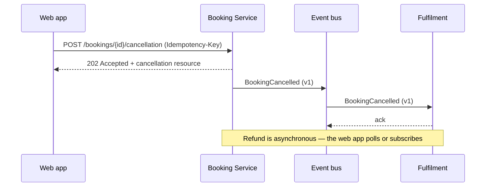

# API-first contracts — OpenAPI and AsyncAPI

Goal of this skill: turn the boundary between two teams or two contexts into an **explicit, versioned, testable artifact** that both sides agree on before either writes code.

Use this skill whenever a requirement spans a team boundary, when integrating with a partner, when splitting a monolith, when a frontend and a backend are built in parallel, or when an event stream becomes a shared dependency.

Do **not** design a contract before the domain language is agreed (`glossary`, `context-mapping`) — an API is the most expensive place to discover that "order" means two things.

---

## 1. Contract-first workflow

1. **Agree the interaction** — which context is upstream, which pattern applies (`context-mapping`), synchronous or event-driven.
2. **Model the resources or events** in the upstream context's own language, filtered to what consumers legitimately need.
3. **Write the contract** — OpenAPI for request/response, AsyncAPI for messages and streams.
4. **Review it with the consumer** before implementation. This is the cheapest moment to change anything.
5. **Generate**: server stubs, client SDKs, mocks, and documentation from the contract — never hand-write both sides.
6. **Develop in parallel** against the mock.
7. **Verify with contract tests** in both pipelines.
8. **Version and evolve** under explicit compatibility rules.

The rule that makes it work: **the contract is the source of truth, not the implementation.** A contract generated from code documents whatever was built, including the accidents.

---

## 2. Choosing the shape

| Interaction | Use | Notes |
|-------------|-----|-------|
| Request/response, client needs an answer now | **OpenAPI** (REST/HTTP) | Default for queries and commands with a result |
| Fire-and-forget notification of something that happened | **AsyncAPI** (events) | Past-tense event names; the publisher owns the schema |
| Streaming or high-volume ingest | AsyncAPI (Kafka, MQTT, WebSocket bindings) | Specify partitioning and ordering guarantees |
| Command sent to another context | AsyncAPI (command message) or OpenAPI POST | Say explicitly which, and where the response goes |
| Highly-coupled internal call with strict typing | gRPC / protobuf | Still write the contract first; the principles are identical |

**Events describe facts, endpoints expose capabilities.** An event named `UpdateCustomer` is a command in disguise; an endpoint named `/processOrderStep2` is a leaked implementation.

---

## 3. Design rules

### Resources and paths (OpenAPI)

- Nouns, plural, lower-case, hyphenated: `/bookings/{bookingId}/cancellations`.
- Model state changes as resources where it clarifies (`POST /bookings/{id}/cancellation`) rather than verbs on the entity.
- Idempotency: every unsafe operation that can be retried takes an idempotency key; document the semantics.
- Pagination, filtering, and sorting specified explicitly, with a maximum page size.
- Never expose internal identifiers or internal state names without a translation (`context-mapping` ACL).

### Events (AsyncAPI)

- Past tense, domain language: `BookingCancelled`, not `booking_update`.
- Every event carries: event id, event type, version, occurrence time, subject/aggregate id, and a correlation id.
- Decide and document the payload style: **event-carried state transfer** (full snapshot, consumers stay decoupled) vs **thin event + lookup** (small, but couples consumers to a query API).
- Specify ordering and delivery guarantees, partition key, and expected consumer idempotency.
- Specify retention and replay: can a new consumer replay history?

### Schemas

- Reuse via components/`$ref`; no copy-pasted object definitions.
- Required vs optional explicitly on every field; no implicit nullability.
- Enumerations closed only when you are certain — an open string with documented values is often safer for evolution.
- Money as minor units plus currency; timestamps as RFC 3339 with an explicit time zone; durations ISO 8601.
- Every field documented with a description that is not a restatement of its name.

### Errors

Use a single, consistent error model — RFC 9457 `application/problem+json`:

| Field | Content |
|-------|---------|
| `type` | Stable URI identifying the error class |
| `title` | Short human-readable summary |
| `status` | HTTP status |
| `detail` | Instance-specific explanation, safe to show |
| `instance` | Identifier of this occurrence (correlation id) |
| extensions | Machine-readable specifics: field violations, retry-after |

Document which errors are retriable, and never leak internal exception text.

### Security

Declare the security schemes in the contract (OAuth2 scopes, mTLS, API keys), state which scopes protect which operations, and state what data is personal so consumers know their obligations.

---

## 4. Versioning and compatibility

| Change | Compatible? | Handling |
|--------|-------------|----------|
| Add an optional field | yes | Ship it; consumers ignore unknown fields |
| Add a new endpoint or event type | yes | Ship it |
| Add a value to an open enumeration | consumer-dependent | Document the consumer contract for unknown values |
| Make an optional field required | **no** | New major version |
| Remove or rename a field | **no** | New major version, deprecation window |
| Change a type or unit | **no** | New major version |
| Change the meaning of a field | **no** — and the most dangerous, because it looks compatible | New field, deprecate the old one |
| Tighten validation | **no** in practice | Treat as breaking |

Rules: semantic versioning on the contract; a documented deprecation window with a sunset date (`Deprecation` / `Sunset` headers for HTTP); consumers tolerate unknown fields; a breaking change requires a migration plan and consumer sign-off (`change-management`).

---

## 5. Verification

| Mechanism | Catches |
|-----------|---------|
| **Contract linting** in CI (Spectral or equivalent) | Style, naming, missing descriptions, missing error responses |
| **Breaking-change detection** against the previous version in CI | Accidental incompatibility before merge |
| **Provider contract tests** | Implementation drifting from the contract |
| **Consumer-driven contract tests** (Pact or equivalent) | The provider breaking a specific consumer's expectations |
| **Schema registry compatibility checks** (events) | Incompatible schema evolution at publish time |
| **Mock server from the contract** | Consumers can build before the provider is ready |
| **Examples validated against the schema** | Documentation that lies |

---

## 6. Intake — ask before designing

Ask only what is missing; batch into one message, five or fewer.

1. **Which two parties**, and which is upstream? What is the relationship pattern (`context-mapping`)?
2. **What does the consumer actually need to do** — the use cases, not the fields they think they want?
3. **Synchronous or event-driven**, and why? What are the latency and consistency expectations?
4. **Who owns the contract**, who approves changes, and how many consumers exist today?
5. **Constraints** — auth model, existing style guide, gateway, schema registry, partner requirements?

---

## 7. Output template

Store the contract as `openapi/<service>-v1.yaml` / `asyncapi/<service>-v1.yaml`; the record below as `docs/specs/api-contract-<name>.md`.

````markdown
# API contract — <Booking Service v1>

- **Owner (provider)**: Team A · **Consumers**: Web app, Partner X, Fulfilment
- **Contract files**: `openapi/booking-v1.yaml`, `asyncapi/booking-events-v1.yaml`
- **Relationship**: Open Host Service + Published Language (see `context-map.md` rel. 1)
- **Status**: agreed <date> · **Version**: 1.3.0 · **Deprecation policy**: 6 months, `Sunset` header

## Consumer needs

| Consumer | Use case | Operations needed | Latency need | Volume |
|----------|----------|-------------------|--------------|--------|
| Web app | Show and cancel a booking | `GET /bookings/{id}`, `POST /bookings/{id}/cancellation` | p95 < 300 ms | 40 rps peak |

## Synchronous operations

| Operation | Method + path | Idempotent | Auth scope | Errors | Notes |
|-----------|---------------|-----------|------------|--------|-------|
| Get booking | `GET /bookings/{bookingId}` | yes | `booking:read` | 404, 403 | ETag supported |
| Cancel booking | `POST /bookings/{bookingId}/cancellation` | yes, via `Idempotency-Key` | `booking:write` | 409 already cancelled, 422 outside window, 503 provider down (retriable) | async refund |

## Events published

| Event | Type | Payload style | Key | Ordering | Retention | Consumers |
|-------|------|---------------|-----|----------|-----------|-----------|
| `BookingCancelled` | domain event | event-carried state transfer | `bookingId` | per key | 30 days, replayable | Fulfilment, Analytics |

## Integration overview



## Error model

RFC 9457 `application/problem+json`. Error types under `https://api.example.com/problems/`.

| `type` | Status | Retriable | Meaning |
|--------|--------|-----------|---------|
| `booking-not-cancellable` | 422 | no | Outside the cancellation window |
| `payment-provider-unavailable` | 503 | yes, with `Retry-After` | Downstream outage |

## Compatibility and change log

| Version | Date | Change | Breaking | Consumers notified | Sunset of previous |
|---------|------|--------|----------|--------------------|--------------------|
| 1.3.0 | <date> | added optional `cancellationReason` | no | — | — |
| 2.0.0 | planned | `refundAmount` becomes minor units | **yes** | Web app, Partner X | <date> |

## Verification

| Check | Where | Blocking |
|-------|-------|----------|
| Spectral lint | provider CI | yes |
| Breaking-change diff vs `main` | provider CI | yes |
| Consumer-driven contract tests | both pipelines | yes |
| Examples validated against schema | provider CI | yes |

## Open questions

| # | Question | Owner | Due |
|---|----------|-------|-----|
````

---

## 8. Anti-patterns

| Anti-pattern | Consequence | Do instead |
|--------------|-------------|------------|
| Contract generated from the implementation | Accidents become the specification | Contract first, code generated from it |
| Internal model exposed verbatim | Consumers couple to your internals; you cannot refactor | Publish a deliberate published language |
| Events named as commands (`UpdateCustomer`) | Consumers become remote controllers of your state | Past-tense facts |
| Meaning of a field changed in place | Silent data corruption in consumers | New field, deprecate the old one |
| No documented error model | Every consumer invents its own handling | One error model, retriability documented |
| No idempotency on retriable writes | Double bookings, double refunds | Idempotency key with defined semantics |
| CRUD-shaped APIs over a rich domain | Business rules migrate into the consumer | Expose capabilities, not tables |
| No deprecation window | Consumers break on a Tuesday morning | Versioning policy with a sunset date |
| Contract agreed verbally, never reviewed by the consumer | Integration fails at the end | Consumer review before implementation |
| No contract tests | The contract and the service drift apart | Provider and consumer-driven tests in CI |
| Unbounded list responses | Fine in test, fatal at p99 | Mandatory pagination with a maximum |

---

## 9. Checklist

- [ ] Upstream/downstream relationship and integration pattern stated
- [ ] Consumer use cases documented before the endpoints or events
- [ ] Domain language from the glossary used in paths, fields, and event names
- [ ] Synchronous vs event-driven choice justified
- [ ] Events named as past-tense facts with id, type, version, time, subject, correlation id
- [ ] Payload style (state transfer vs thin event) decided and documented
- [ ] Ordering, delivery, retention, and replay guarantees specified
- [ ] Schemas reuse components; required/optional explicit; units and formats defined
- [ ] Single error model (RFC 9457) with retriability documented
- [ ] Idempotency specified for every retriable write
- [ ] Pagination limits specified for every collection
- [ ] Security schemes and scopes declared; personal data flagged
- [ ] Versioning and deprecation policy written, with a sunset mechanism
- [ ] Contract reviewed and signed off by every current consumer
- [ ] Lint, breaking-change detection, and contract tests wired into CI
- [ ] Mock server available for parallel development
