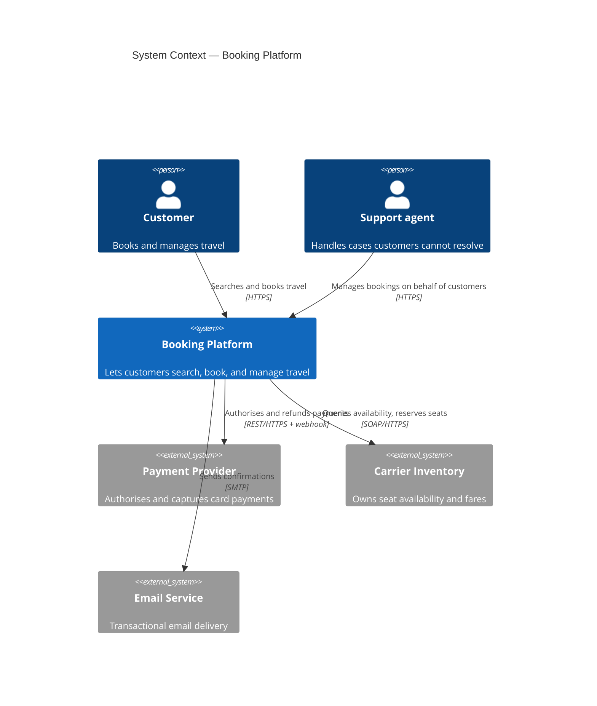
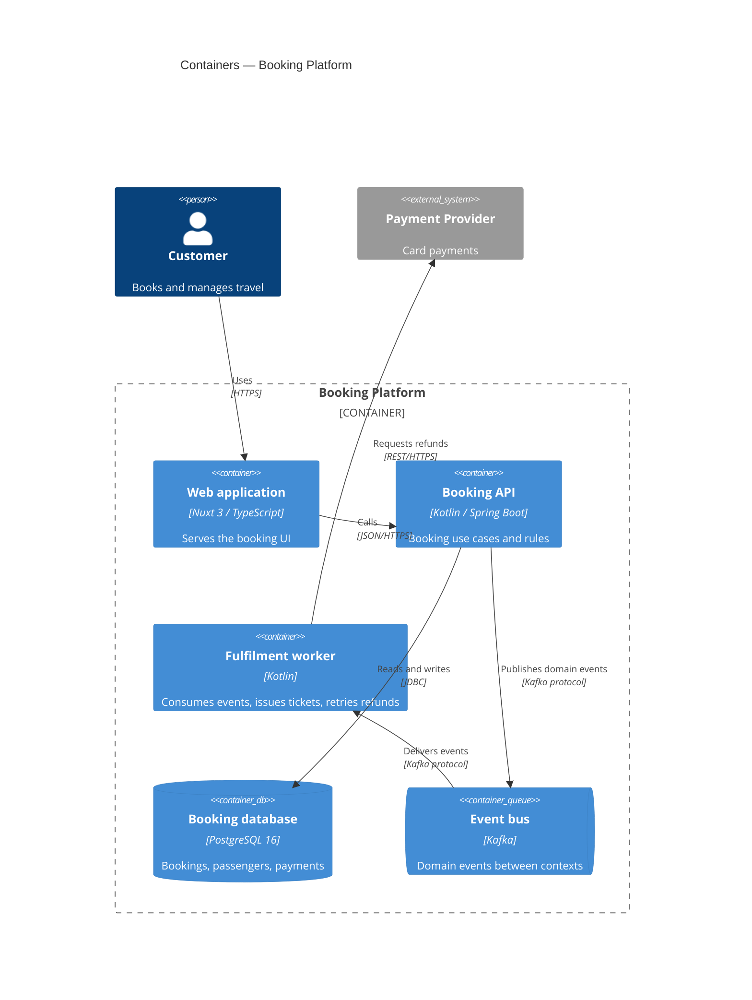
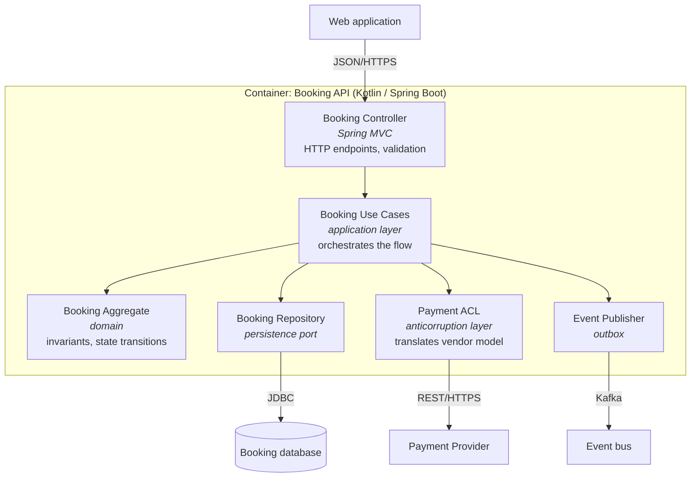
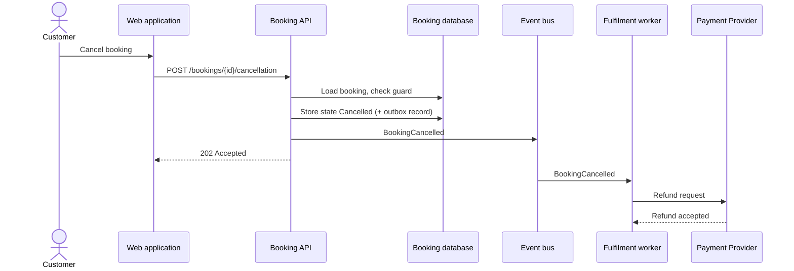

# C4 diagrams

Goal of this skill: draw system boundaries and structure at **one abstraction level at a time**, so that a diagram is readable by the audience it is meant for — and so nobody has to guess whether a box is a server, a service, a class, or a team.

Use this skill to show where a system sits among its users and neighbours, to onboard people onto an architecture, to agree a system boundary before designing services, or to make an integration landscape visible before a migration.

Do **not** use it to model the domain (`context-mapping`, `event-storming`), to specify behaviour (`use-case-modeling`, `process-modeling`), or to record why an architecture was chosen — that is an architecture decision record.

---

## 1. The levels

Zoom in one level at a time. Each level has a different audience and a hard rule about what may appear.

| Level | Question | Audience | Boxes are | Rule |
|-------|----------|----------|-----------|------|
| **1 — System Context** | What is this system, who uses it, what does it talk to? | Everyone, including non-technical | People and software systems | **No technology names.** One box for your system |
| **2 — Container** | What are the deployable/runnable parts? | Developers, ops, architects | Applications, services, databases, file stores, message brokers | Each container is separately deployable or runnable. Technology named per container |
| **3 — Component** | What are the major building blocks inside one container? | Developers of that container | Groupings of code with a clear responsibility | Draw only for containers where it earns its keep |
| **4 — Code** | How is a component implemented? | The developer touching it | Classes, functions, schemas | Generate from code or skip entirely — it rots fastest |

Supplementary views:

| View | Purpose |
|------|---------|
| **System landscape** | Several systems in an enterprise, above level 1 |
| **Dynamic** | How elements collaborate for one scenario — numbered interactions |
| **Deployment** | Which containers run on which infrastructure, per environment |

A "container" in C4 means a deployable/runnable unit. It is **not** a Docker container, although it is often shipped as one. Say this out loud when introducing the diagram to a new audience.

---

## 2. Intake — ask before drawing

Ask only what is missing; batch into one message, five or fewer.

1. **Which system**, and where exactly is its boundary — what is inside, what is outside?
2. **Which level** does the audience need, and who is the audience?
3. **Who and what interacts with it** — user roles, external systems, batch jobs, partners?
4. **Which containers exist** (for level 2) — applications, services, datastores, brokers, scheduled jobs — and what technology is each?
5. **Is this current state or target state?** If both, produce two diagrams.

Scheduled jobs, batch imports, and reporting databases are the elements most often forgotten. Ask about them explicitly.

---

## 3. Rules that keep C4 diagrams usable

- **One level per diagram.** A box that is a service next to a box that is a class makes the diagram unreadable.
- **Every element has a name, a type, and a one-line description.** "Auth" tells the reader nothing; "Auth Service — Go — issues and validates access tokens" does.
- **Every arrow is labelled** with intent and, from level 2 down, with the protocol: *"reads booking data from — JSON/HTTPS"*.
- **Arrow direction is dependency or data flow — pick one convention per diagram and state it.**
- **Always include a legend**, including the colour convention (typically: your system, external system, person, datastore).
- **Diagram fits on one screen.** More than ~15 boxes means you are mixing levels or need to split.
- **Say whether it is current or target state**, and put a date on it.
- **Diagrams as code** — keep the source in the repository next to the code it describes, review it in pull requests, and let it go stale visibly rather than silently in a wiki.
- **Do not draw every component of every container.** Draw level 3 only where the internal structure is genuinely non-obvious and worth maintaining.

---

## 4. Output template

Write to `docs/architecture/c4-<system>.md`.

````markdown
# C4 — <Booking Platform> (<current | target> state)

- **Date**: <YYYY-MM-DD> · **Owner**: <team> · **Arrow convention**: data flow
- **Scope**: what is inside the system boundary: <…>; explicitly outside: <…>

## Level 1 — System Context



| Element | Type | Description | Owner |
|---------|------|-------------|-------|
| Booking Platform | our system | Search, book, manage travel | Team A |
| Payment Provider | external | Card authorisation and refunds | vendor (Stripe) |

## Level 2 — Containers



| Container | Technology | Responsibility | Deployable unit | Data owned | Team |
|-----------|-----------|----------------|-----------------|------------|------|
| Booking API | Kotlin / Spring Boot | Booking use cases, invariants | container image | booking schema | Team A |

## Level 3 — Components (Booking API only)



| Component | Responsibility | Depends on |
|-----------|----------------|------------|
| Payment ACL | Translates the vendor payment model into the domain model | Payment Provider API |

## Dynamic view — <cancel a booking>



## Deployment view — <production>

| Container | Runs on | Instances | Scaling | Notes |
|-----------|---------|-----------|---------|-------|
| Booking API | EKS, namespace `booking` | 4 | HPA on CPU | zone-redundant |

## Legend and conventions

- Arrows show **data flow**; the label states intent and protocol.
- `System_Ext` / dashed elements are outside our control.
- One diagram per level; boxes on a level are of one kind only.

## Open questions

| # | Question | Owner | Due |
|---|----------|-------|-----|
````

> Mermaid's `C4Context` / `C4Container` support is experimental and its layout control is limited. If a diagram becomes unreadable, fall back to a `flowchart` with `subgraph` boundaries and a written legend — as used for the component level above. Structurizr DSL or PlantUML C4-PlantUML are the alternatives when you need full C4 tooling.

---

## 5. Keeping diagrams alive

| Practice | Effect |
|----------|--------|
| Diagram source in the repo, next to the code | Changes and reviews happen together |
| Rendered in the README or docs site from source | No stale exported PNGs |
| Update required in the definition of done for architectural changes | Drift is caught at the source |
| Date and owner on every diagram | Readers can judge staleness |
| Levels 1 and 2 maintained; level 3 only where it pays; level 4 generated or omitted | Effort goes where the value is |
| ADR links from the diagram to the decisions behind it | The "why" stays findable |

---

## 6. Anti-patterns

| Anti-pattern | Consequence | Do instead |
|--------------|-------------|------------|
| Mixing levels in one diagram | Unreadable; discussion derails into "what is that box?" | One level per diagram |
| Technology names at level 1 | Business audience disengages | Level 1 is technology-free |
| Unlabelled arrows | Readers invent the semantics | Intent plus protocol on every arrow |
| Boxes without descriptions | Ambiguous ownership and purpose | Name, type, one-line description |
| No legend | Colours and shapes get reinterpreted | Legend on every diagram |
| Forty boxes on one diagram | Nobody reads it | Split, or move up a level |
| Only the target state drawn | The current landscape stays unknown during migration | Current and target, separately |
| Diagrams in a wiki, exported by hand | Stale within one sprint | Diagrams as code in the repository |
| Level 3 and 4 for every container | Maintenance cost exceeds value | Only where structure is non-obvious |
| "Container" explained as Docker | Confused audience | Say: separately deployable/runnable unit |
| Batch jobs and reporting DBs omitted | Migration surprises | Ask for them explicitly |

---

## 7. Checklist

- [ ] System boundary explicitly stated: what is in, what is out
- [ ] Level labelled on every diagram; only one level per diagram
- [ ] Level 1 free of technology names
- [ ] Every element has a name, a type, and a one-line description
- [ ] Every relationship labelled with intent and (level 2+) protocol
- [ ] Arrow convention (dependency or data flow) stated
- [ ] Legend present
- [ ] Scheduled jobs, batch flows, reporting stores, and partner integrations included
- [ ] Current state and target state kept separate
- [ ] Diagram fits on one screen (~15 boxes max)
- [ ] Dynamic view included for at least one important scenario
- [ ] Deployment view per environment where it matters
- [ ] Diagram source stored in the repository and rendered from source
- [ ] Date, owner, and links to related ADRs present
