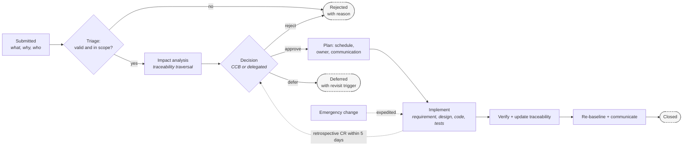

# Change management and versioning

Goal of this skill: let requirements evolve **deliberately** — every change assessed for impact, decided by someone accountable, communicated to everyone affected, and recorded — without turning the project into a paperwork engine.

Use this skill after a baseline exists (`baselining`), in contractual and regulated delivery, for published interfaces with external consumers (`api-contracts`), and whenever a change would affect a commitment somebody else is relying on.

Do **not** apply change control to un-baselined backlog items. Re-prioritising a backlog is not a change request; it is the normal operation of the process. Change control applies to what has been *committed*.

---

## 1. When change control is justified

| Situation | Mechanism |
|-----------|-----------|
| Item still in the backlog, no commitment made | Re-prioritise (`prioritization`) — no change request |
| Item committed for the current iteration | Team decides; swap out something of equal size, record it |
| Baselined requirement, internal product | Lightweight change request: impact, decision, log entry |
| Baselined requirement under contract or regulation | Full change control: CR, impact analysis, board decision, re-baseline |
| Published API or event schema | Versioning policy plus consumer notification (`api-contracts`) |
| Emergency (production incident, legal order) | Expedited path with retrospective documentation — never skipped, only deferred |

The failure modes are symmetrical: **too much control** makes teams route around the process, so real changes become invisible; **too little** means commitments quietly change and someone finds out at acceptance.

---

## 2. Change request lifecycle



Each stage has an owner and a service-level expectation (for example: triage within 2 working days, impact analysis within 5, decision at the next board). Publish those expectations — an unpredictable change process is routed around.

---

## 3. What a change request must contain

| Field | Why |
|-------|-----|
| Id, date, requester, and requester's role | Accountability |
| Description of the change | What exactly changes |
| **Reason / driver** | Regulatory, market, defect, new understanding, cost — the driver decides urgency |
| Affected requirements (ids) | Entry point for the impact analysis |
| **Impact analysis** | Forward, backward, sideways, and external (`traceability`) |
| Effort and cost estimate | With a confidence range |
| Risk of doing it / risk of not doing it | Both sides, explicitly |
| Alternatives considered | Including "do nothing" |
| Affected parties to be notified | Consumers, partners, support, training, legal |
| Decision, decider, date | Recorded, not implied |
| Target baseline / release | Where it lands |

**Reason is not optional.** A change log full of "requested by the customer" teaches nothing; a log that shows 40 % of changes come from missing failure-path analysis tells you exactly what to fix upstream.

---

## 4. The change control board

| Aspect | Recommendation |
|--------|----------------|
| Members | Product owner, engineering lead, QA, operations; plus legal and security when relevant; a customer representative in contractual work |
| Authority | Explicit thresholds — below a size/cost limit the product owner decides alone; above it, the board; above a second threshold, the sponsor |
| Cadence | Fixed and frequent enough that people wait rather than bypass — weekly is typical |
| Inputs | CR with completed impact analysis; incomplete CRs are returned, not debated |
| Decision protocol | Announced in advance (`workshop-facilitation`) |
| Output | Approve / reject / defer, with a written rationale and dissent recorded |

Delegate aggressively. A board that must approve a copy change will be bypassed within a month, and then the changes that genuinely matter also become invisible.

---

## 5. Versioning

| Artifact | Scheme | Rules |
|----------|--------|-------|
| **Specification document** | `MAJOR.MINOR` plus a baseline id | MINOR for clarifications, MAJOR for scope changes; every version records the CRs it contains |
| **Individual requirement** | Version per requirement | Impact analysis needs to know which version a test verified |
| **API / event contract** | Semantic versioning | Breaking changes require a major version, a deprecation window, and consumer sign-off |
| **Data schema** | Compatibility mode declared (backward, forward, full) | Enforced in the registry, not by convention |
| **Baseline** | Immutable snapshot id + date | Never edited after approval (`baselining`) |

Keep specifications in version control alongside the code where possible: pull requests give you review, diffs, history, and approval for free, and they make "who changed this and why" answerable in seconds.

---

## 6. Communication obligations

A change is not done when it is implemented; it is done when everyone who relied on the old behaviour knows.

| Affected party | Owes them |
|----------------|-----------|
| API consumers | Version notice, migration guide, deprecation window with a sunset date |
| Partners under contract | Formal notice within the contractual notice period |
| Support and operations | Updated runbooks, expected customer questions, rollback plan |
| Training and documentation | Updated material before the change is live |
| Test and QA | Updated acceptance tests before implementation |
| Legal / compliance | Confirmation that the obligation is still satisfied |
| End users | In-product notice where behaviour they rely on changes |

---

## 7. Intake — ask before designing the process

Ask only what is missing; batch into one message, five or fewer.

1. **What is under change control** — which baselines, contracts, or published interfaces?
2. **Who decides**, at which thresholds, and how quickly do they meet?
3. **Who must be notified** when a committed requirement changes — internal and external?
4. **What is the current pain** — untracked changes, slow approvals, or surprised consumers?
5. **What tooling exists** — issue tracker, requirements tool, version control, schema registry?

---

## 8. Output templates

### 8.1 Change request

````markdown
# CR-17 — Cancellation window changes from 24 h to 48 h

| | |
|---|---|
| Requester | <name>, Commercial |
| Date | <YYYY-MM-DD> |
| Driver | market — competitor offers 48 h; retention data supports it |
| Urgency | normal · target release R3 |
| Affected requirements | REQ-014, REQ-018, QA-2 |
| Affected baseline | BL-2026-08 |

## Change

The free-cancellation window changes from 24 hours to 48 hours before departure. The fee rules for the remaining window are unchanged.

## Impact analysis

| Direction | Item | Change | Effort | Risk |
|-----------|------|--------|--------|------|
| forward | REQ-014, REQ-018 | threshold value | S | low |
| forward | `state-machine-booking.md` guard G1 | guard value | S | low |
| forward | T-114, T-116, T-119 | boundary cases rewritten | M | medium |
| forward | `openapi/booking-v1.yaml` | description + examples, non-breaking | S | low |
| forward | Help centre HC-88, agent training | update | S | low |
| backward | G-1 reduce support load | still satisfied; re-measure after release | — | low |
| sideways | REQ-022 fare rules `depends-on` | policy alignment required | M | medium |
| external | Partner X integration guide | 30-day contractual notice | S | **medium** |

**Estimate**: 8–13 points (confidence medium) · **Revenue impact**: modelled at −€18k to −€30k per quarter in fees, offset by retention

## Alternatives considered

| Option | Why not chosen |
|--------|----------------|
| Do nothing | Retention gap vs competitor persists |
| 48 h for loyalty members only | Adds a segmentation rule to the fare engine; higher complexity, deferred |

## Risks

| Doing it | Not doing it |
|----------|--------------|
| Fee revenue drop; boundary defects around the new threshold | Continued churn to the competitor at renewal |

## Decision

| | |
|---|---|
| Decision | **approved with condition** |
| Condition | 30-day partner notice sent before release; boundary tests re-reviewed |
| Decided by | CCB, <date> |
| Dissent | Finance noted the revenue impact; accepted, to be reviewed after one quarter |
| Lands in | BL-2026-11, release R3 |

## Communication

| Party | Message | Owner | By |
|-------|---------|-------|-----|
| Partner X | contractual notice | <name> | <date> |
| Support | updated runbook + FAQ | <name> | <date> |
| Customers | in-product notice | <name> | release day |
````

### 8.2 Change log

````markdown
# Change log — <specification> (baseline BL-2026-08 → BL-2026-11)

| CR | Date | Change | Type | Requirements | Driver | Decision | Version |
|----|------|--------|------|--------------|--------|----------|---------|
| CR-15 | <date> | Clarify that "30 days" means calendar days | clarification | REQ-032 | review defect D3 | approved | 1.1 |
| CR-17 | <date> | Cancellation window 24 h → 48 h | scope | REQ-014, REQ-018 | market | approved with condition | 2.0 |
| CR-18 | <date> | Add partial refunds | scope | new REQ-041 | customer | deferred → revisit when partner volume > 500/mo | — |

## Change metrics — <period>

| Metric | Value | Interpretation |
|--------|-------|----------------|
| CRs raised | 18 | |
| Approved / rejected / deferred | 11 / 3 / 4 | |
| Median time to decision | 6 days | within the published SLA |
| Changes by driver | market 5 · defect 4 · **missing failure-path analysis 6** · regulatory 2 · cost 1 | **six changes caused by a gap in elicitation — add obstacle analysis to refinement** |
| Requirements volatility | 13 % of baselined requirements changed | above the 10 % trigger — review elicitation coverage |
| Emergency changes | 1 (retrospectively documented ✅) | |
````

---

## 9. Anti-patterns

| Anti-pattern | Consequence | Do instead |
|--------------|-------------|------------|
| Change control on un-baselined backlog items | Bureaucracy; teams route around the process | Control commitments, not candidates |
| Approving changes without impact analysis | Contract breaches and regressions found late | Traverse the traceability links every time |
| No recorded reason for changes | No learning about why requirements keep changing | Driver field, analysed periodically |
| Board that must approve everything | Bypassed within a month; real changes become invisible | Delegate by threshold |
| Unpredictable decision timing | People implement first and ask later | Publish and hold decision SLAs |
| Emergency changes never documented | Baseline diverges silently from reality | Expedited path with retrospective CR |
| Changing the meaning of a field in place | Silent breakage in consumers | New field, deprecate the old one |
| Consumers notified after the change ships | Broken integrations and lost trust | Notice with a deprecation window before release |
| Specification edited without a version bump | Nobody knows which version was verified | Version and baseline every change |
| Rejecting changes to protect the plan | The product diverges from reality | Assess honestly; reject with a reason, not by reflex |
| No volatility metrics | Repeated elicitation gaps stay invisible | Track changes by driver and act upstream |

---

## 10. Checklist

- [ ] Scope of change control defined — what is baselined and what is not
- [ ] Decision thresholds and delegation levels published
- [ ] Board cadence and decision SLAs published and held
- [ ] Every CR states the driver, not only the request
- [ ] Impact analysis traverses forward, backward, sideways, and external commitments
- [ ] Effort estimate with a confidence range, and the risk of both acting and not acting
- [ ] Alternatives, including "do nothing", recorded
- [ ] Decision, decider, date, conditions, and dissent recorded
- [ ] Affected parties identified, with an owner and a date per notification
- [ ] Contractual and deprecation notice periods respected
- [ ] Requirement, design, tests, contracts, and documentation updated together
- [ ] Traceability links updated; acceptance tests updated before implementation
- [ ] Version bumped and the baseline updated
- [ ] Emergency changes documented retrospectively within a defined window
- [ ] Change metrics reviewed; recurring drivers fed back into elicitation
