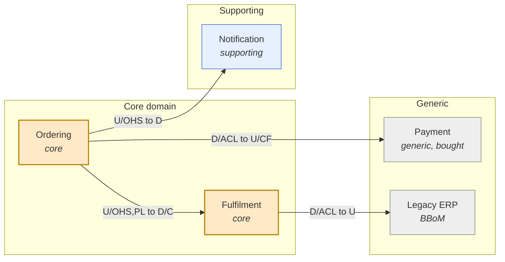

# Domain model and DDD context mapping

Goal of this skill: take the timeline and pivotal events from Event Storming and produce a **context map** — named bounded contexts, their models, their teams, and the integration pattern on every boundary between them.

Use this skill after `event-storming` or `domain-storytelling`, before deciding service boundaries, when planning a monolith split, when two teams keep breaking each other, or when the same word means two different things in two systems.

Do **not** use it to discover the domain in the first place (`event-storming`) or to design the internals of one context (`data-modeling`, `state-machines`).

---

## 1. What a bounded context is

A bounded context is the boundary within which **one model and one vocabulary are consistent**. Outside it, the same word may mean something else — and that is fine, as long as the boundary is explicit and the translation is deliberate.

Boundary heuristics, in order of strength:

| Heuristic | Signal | Weight |
|-----------|--------|--------|
| **Language change** | The same term means something different on the other side ("order" in sales vs in fulfilment) | Strongest |
| **Pivotal event** | Responsibility visibly changes hands on the Event Storming timeline | Strong |
| **Different rate of change** | One part changes weekly, the other yearly | Strong |
| **Different ownership** | Another team or department decides the rules | Strong |
| **Different consistency need** | One needs strong transactional consistency, the other tolerates lag | Strong |
| **Different lifecycle** | The data lives on after the other side is done with it | Medium |
| **Different compliance regime** | One side is regulated, the other is not | Medium |
| **Data coupling only** | "They both use the customer table" | **Weak — never split on this alone** |

Anti-heuristic: do not derive contexts from the org chart alone, and do not derive them from the existing database schema. Both encode past decisions, not the domain.

---

## 2. The relationship patterns

Every boundary gets exactly one pattern, plus the direction of the dependency.

| Pattern | Notation | Meaning | Use when | Cost |
|---------|----------|---------|----------|------|
| **Partnership** | `P` | Two contexts succeed or fail together; coordinated planning and releases | Two teams with a shared deadline and mutual dependency | High coordination |
| **Shared Kernel** | `SK` | A shared subset of the model and code, jointly owned | Very small, very stable overlap | High — changes need both teams' consent |
| **Customer / Supplier** | `C` / `S` | Downstream (customer) needs are planned into the upstream (supplier) backlog | Upstream is willing and able to prioritise downstream needs | Medium |
| **Conformist** | `CF` | Downstream adopts the upstream model as-is, no translation | Upstream will not change, and its model is tolerable | Low effort, high model pollution |
| **Anticorruption Layer** | `ACL` | Downstream translates the upstream model into its own | Upstream model is unsuitable, legacy, or unstable | Medium — the safest default toward legacy |
| **Open Host Service** | `OHS` | Upstream publishes a stable, general-purpose protocol for many consumers | Many downstreams, upstream can invest in an API | Medium |
| **Published Language** | `PL` | A shared, documented interchange format (events, schema) | Combined with OHS; industry standards (e.g. EDI, FHIR) | Medium |
| **Separate Ways** | `SW` | No integration at all; duplicate the small bit that is needed | Integration costs more than duplication | Low |
| **Big Ball of Mud** | `BBoM` | No consistent model; mark it and do not extend it | Legacy reality | Contain with an ACL |

Upstream / downstream is the key axis: **upstream changes force downstream work.** Draw the arrow from upstream to downstream and mark `U` and `D`.

---

## 3. Intake — ask before mapping

Ask only what is missing; batch into one message, five or fewer.

1. **What is the input** — an Event Storming wall, an existing system landscape, or a greenfield idea? Can you share it?
2. **Which contexts do you already suspect**, and what is each one's core responsibility in one sentence?
3. **Who owns what** — which team owns which context or system today, and who owns the boundaries nobody claims?
4. **What is the goal of the map** — a service split, a team reorganisation, an integration strategy, or documenting the status quo?
5. **What is fixed** — legacy systems, vendor products, or organisational boundaries that cannot move?

If you are mapping the current state and the target state, produce **two maps** and diff them. A single map that mixes both is unreadable.

---

## 4. Method

1. **Start from pivotal events.** Cut the Event Storming timeline at the points where language and responsibility change. Each chunk is a candidate context.
2. **Name each context in its own language.** The name should be a noun phrase a domain expert recognises: `Ordering`, `Fulfilment`, `Billing` — never `OrderService` or `Layer 2`.
3. **Write a one-sentence purpose per context.** If it needs "and", you probably have two contexts.
4. **Classify by strategic value:**
   - **Core domain** — your differentiator. Build it, staff it best.
   - **Supporting** — necessary, not differentiating. Build simply or outsource.
   - **Generic** — a solved problem (auth, payments, invoicing). Buy it.
   Spending your best people on a generic subdomain is the most common strategic error this map exposes.
5. **Draw every boundary and assign a pattern and a direction.** A boundary with no pattern is an unplanned coupling.
6. **Check the model translation on each boundary.** What term maps to what? Where does meaning get lost?
7. **Check team topology.** One context should have exactly one owning team; one team may own several contexts. If two teams own one context, either split the context or merge the ownership.
8. **Mark the pain.** Which boundaries break most often? Those are the ones to redesign first.

---

## 5. Output template

Write to `docs/discovery/context-map-<scope>.md`.

````markdown
# Context Map — <scope> (<current state | target state>)

- **Date**: <YYYY-MM-DD> · **Based on**: <event storming session / system analysis>
- **Participants**: … · **Review date**: <YYYY-MM-DD>

## Map



Edge label reads `<upstream role> to <downstream role>`: `U` upstream, `D` downstream,
`OHS` open host service, `PL` published language, `ACL` anticorruption layer,
`CF` conformist, `C/S` customer–supplier, `P` partnership, `SK` shared kernel, `SW` separate ways.

## Contexts

| Context | Purpose (one sentence) | Type | Owning team | Key terms | System(s) today |
|---------|------------------------|------|-------------|-----------|-----------------|
| Ordering | Captures and confirms customer purchase intent | core | Team A | order, basket, line item | `order-service` |
| Payment | Authorises and captures money | generic (vendor) | Team B | charge, refund, mandate | Stripe |

## Relationships

| # | Upstream | Downstream | Pattern | Integration | Model translation | Pain today | Action |
|---|----------|------------|---------|-------------|-------------------|-----------|--------|
| 1 | Ordering | Fulfilment | OHS + PL / Customer–Supplier | `OrderConfirmed` event, Avro schema v3 | `order` to `shipment job` | schema changes break consumers | add contract tests |
| 2 | Payment (vendor) | Ordering | Conformist behind ACL | REST + webhook | `charge` to `payment` | vendor renames fields silently | ACL owns the mapping |

## Language conflicts across boundaries

| Term | Meaning in <context A> | Meaning in <context B> | Translation rule |
|------|------------------------|------------------------|------------------|
| Order | Customer's purchase intent, may be unpaid | A picking job in the warehouse | `OrderConfirmed` creates a `PickingJob` only for paid orders |

## Strategic assessment

| Context | Type | Build / buy / outsource | Rationale | Staffing today | Mismatch? |
|---------|------|-------------------------|-----------|----------------|-----------|

## Risks and next steps

| # | Risk / issue | Boundary | Impact | Action | Owner | Due |
|---|--------------|----------|--------|--------|-------|-----|
````

### Bounded Context Canvas (one per context)

````markdown
# Bounded Context — <name>

- **Purpose**: <one sentence>
- **Strategic classification**: core | supporting | generic · **Owning team**: <team>
- **Business model**: revenue generator | engagement creator | compliance enforcer | cost reduction
- **Model traits**: <e.g. rich behaviour, high change rate, regulated>

## Ubiquitous language

| Term | Definition | Not to be confused with |
|------|------------|-------------------------|

## Inbound communication

| From | Message / call | Type (command, query, event) | Contract |
|------|----------------|------------------------------|----------|

## Outbound communication

| To | Message / call | Type | Contract |
|----|----------------|------|----------|

## Business decisions and rules owned here

- …

## Assumptions and open questions

| # | Assumption | Risk if wrong | Validation |
|---|------------|---------------|------------|
````

---

## 6. Anti-patterns

| Anti-pattern | Consequence | Do instead |
|--------------|-------------|------------|
| Contexts derived from the database schema | You encode the legacy model forever | Derive from language and pivotal events |
| Contexts named after technology (`OrderService`) | The map stops being about the domain | Name in the domain's own words |
| One shared "Customer" model everywhere | Every change touches every team | Let each context hold its own view; translate at boundaries |
| Boundaries with no declared pattern | Unplanned coupling discovered in production | Every edge gets a pattern and a direction |
| Shared Kernel as the default | Two teams blocked on every change | Prefer OHS + PL, or an ACL |
| Conformist toward a volatile legacy system | Legacy chaos leaks into your core | ACL toward anything you do not control |
| Best engineers on a generic subdomain | Differentiation starves | Classify first; buy generic |
| Map drawn once, never revisited | Diverges silently from reality | Date it and set a review trigger |
| Current and target state on one diagram | Nobody knows what is real | Two maps, plus a diff |

---

## 7. Checklist

- [ ] Contexts derived from language change and pivotal events, not from the schema or org chart
- [ ] Each context has a one-sentence purpose and a domain-language name
- [ ] Each context classified as core / supporting / generic, with a build-buy decision
- [ ] Exactly one owning team per context
- [ ] Every boundary has a pattern, a direction (upstream/downstream), and an integration mechanism
- [ ] Model translation documented for every boundary that renames or reinterprets a concept
- [ ] Language conflicts listed with explicit translation rules
- [ ] Staffing mismatches against strategic classification flagged
- [ ] Current state and target state kept as separate maps
- [ ] Map dated with a review trigger; risks have owners and dates
