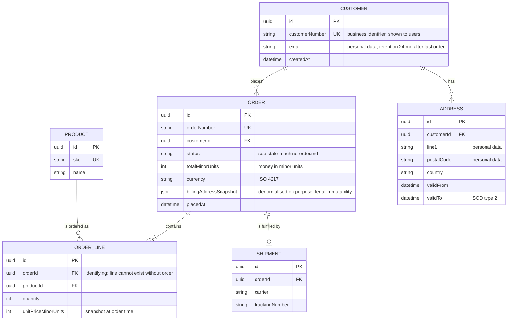

# Data models and ER diagrams

Goal of this skill: describe **what data exists, what identifies it, and how it relates** — at the right level of abstraction for the decision at hand, in the vocabulary of one bounded context.

Use this skill after the domain is understood, when designing persistence, when reverse-engineering a legacy schema, when reconciling several systems' views of "customer", or when data protection and retention rules must be located in the model.

Do **not** use it to discover the domain (`event-storming`), to model behaviour (`state-machines`), or to define system boundaries (`c4-diagrams`, `context-mapping`). A data model drawn before the language is agreed will encode the wrong nouns.

---

## 1. The three levels — do not mix them

| Level | Audience | Contains | Excludes |
|-------|----------|----------|----------|
| **Conceptual** | Business and domain experts | Entities, relationships, business identifiers, cardinality | Types, keys, nullability, tables |
| **Logical** | Analysts, developers | Attributes, primary and foreign keys, normalisation, constraints | Vendor types, indexes, partitioning |
| **Physical** | Developers, DBAs | Tables, columns, types, indexes, partitions, storage | — |

Most modeling arguments come from two people working at different levels. Label every diagram.

**One model per bounded context.** A single enterprise-wide model is the classic failure: `Customer` in sales, in billing, and in support genuinely are different concepts. Model each separately and record the translation in `context-mapping`.

---

## 2. Intake — ask before modeling

Ask only what is missing; batch into one message, five or fewer.

1. **Which context and which level** — conceptual, logical, or physical?
2. **Which entities do you already know**, and what identifies each one in the business (not the surrogate key — the thing a human would quote)?
3. **What are the rules on relationships** — required or optional, one or many, and can they change over time?
4. **What history is needed** — must past values be reconstructable, and for which entities? Any audit or regulatory retention requirement?
5. **What personal data is involved**, and what are the retention and erasure rules?

If the input is an existing schema, ask whether the goal is to document it, to critique it, or to design its replacement — the three produce different documents.

---

## 3. Modeling rules

### Entities

- Singular noun in the domain's language: `Booking`, not `Bookings` or `TBL_BKG`.
- Every entity has a **business identifier** (booking reference, IBAN, order number) even when a surrogate key is used technically. Write both.
- If an entity has no attributes beyond its keys, it is probably a relationship, not an entity.

### Relationships

- Name relationships with a verb readable in both directions: *"a Customer **places** many Orders; an Order **is placed by** exactly one Customer"*.
- State cardinality **and** optionality on both ends. `0..1`, `1`, `0..*`, `1..*`.
- Resolve many-to-many into an associative entity as soon as it carries its own attributes (`Enrolment` with a date and a grade, not just a join table).
- **Weak entities** (an `OrderLine` that cannot exist without its `Order`) — mark identifying relationships explicitly; they determine cascade and aggregate boundaries.

### Attributes

- Domain-meaningful names; no `flag1`, no type-prefixed Hungarian names.
- Record the **unit and precision** for anything measurable — money (currency + minor units), distances, durations. Money as a float is a defect, not a style choice.
- Mark nullability and say **what null means** for each nullable attribute — "unknown", "not applicable", and "not yet" are three different things and should usually be three different designs.
- Enumerations: list the allowed values and where they are owned.

### Normalisation

Normalise to 3NF as the default: no repeating groups, no partial dependencies on part of a composite key, no transitive dependencies on non-key attributes. Then **denormalise deliberately and document why** — copies for read performance, snapshots for legal immutability (an invoice must keep the address as it was), and reporting models are all legitimate. An undocumented copy is a future inconsistency.

### Time

| Need | Pattern |
|------|---------|
| Current value only | Plain attribute |
| Past values reconstructable | Validity interval (`validFrom`, `validTo`) — SCD type 2 |
| When we *knew* it, not only when it *held* | Bitemporal: valid time + transaction time |
| Immutable record of what was agreed | Snapshot the values onto the document (invoice, contract) |
| Full history of change | Event log / append-only table |

### Deletion and personal data

- Decide per entity: hard delete, soft delete (`deletedAt`), or anonymisation. Soft delete leaks into every query — adopt it deliberately, not by habit.
- Mark every attribute holding personal data, its legal basis, its retention period, and the erasure strategy. GDPR erasure and "we keep everything forever" are incompatible; find out which wins before the schema exists.

---

## 4. Output template

Write to `docs/discovery/data-model-<context>.md`.

````markdown
# Data model — <Ordering context> (<conceptual | logical | physical>)

- **Date**: <YYYY-MM-DD> · **Bounded context**: Ordering · **Owner**: Team A
- **Level**: logical · **Source**: event storming <link>, legacy schema `orders_db` <date>

## Diagram



## Entities

| Entity | Meaning | Business identifier | Surrogate key | Lifecycle | Volume (today / 3 y) |
|--------|---------|--------------------|---------------|-----------|----------------------|
| Order | A confirmed purchase intent | `orderNumber` | `id` (uuid) | see `state-machine-order.md` | 1.2 M / 5 M |

## Relationships

| From | To | Reads as | Cardinality | Optional? | Identifying? | On delete |
|------|----|----------|-------------|-----------|--------------|-----------|
| Customer | Order | a customer places orders | 1 : 0..* | order requires a customer | no | restrict |
| Order | OrderLine | an order contains lines | 1 : 1..* | order needs ≥1 line | yes | cascade |

## Attributes of note

| Entity.attribute | Type | Null allowed | Meaning of null | Unit / precision | Personal data | Retention |
|------------------|------|--------------|-----------------|------------------|---------------|-----------|
| Order.totalMinorUnits | int | no | — | minor units of `currency` | no | — |
| Customer.email | string | no | — | — | yes (contact) | 24 mo after last order, then anonymise |

## Constraints and invariants

| # | Constraint | Enforced where | Rationale |
|---|-----------|----------------|-----------|
| C1 | `Order.total = Σ(line.quantity × line.unitPrice)` | application (aggregate invariant) | consistency inside the Order aggregate |
| C2 | `orderNumber` unique | database unique index | business identifier |
| C3 | An order in `Confirmed` has ≥1 line | application + check constraint | no empty orders |

## Deliberate denormalisation

| # | Copy | Source of truth | Why | Refresh / immutability |
|---|------|-----------------|-----|------------------------|
| D1 | `Order.billingAddressSnapshot` | Address | invoices must show the address as it was | frozen at `placedAt`, never updated |

## History and time

| Entity | Pattern | Retention | Rationale |
|--------|---------|-----------|-----------|
| Address | SCD type 2 (`validFrom` / `validTo`) | 10 y (tax) | reconstruct where an order was sent |

## Deletion and personal data

| Entity | Strategy | Trigger | Fields affected | Legal basis |
|--------|----------|---------|-----------------|-------------|
| Customer | anonymise | erasure request or 24 mo inactivity | email, name, addresses | GDPR Art. 17 |

## Glossary

| Term | Definition in this context | Different meaning elsewhere |
|------|---------------------------|------------------------------|
| Order | Confirmed purchase intent, at least one line | In Fulfilment: a picking job |

## Open questions

| # | Question | Owner | Due |
|---|----------|-------|-----|
````

---

## 5. Anti-patterns

| Anti-pattern | Consequence | Do instead |
|--------------|-------------|------------|
| One enterprise-wide data model | Endless negotiation; a model nobody's domain matches | One model per bounded context, translated at boundaries |
| Data model drawn before the language is agreed | Wrong nouns baked into the schema | Run `event-storming` / `domain-storytelling` first |
| Mixing conceptual, logical and physical | Business readers drown; developers get no detail | Label the level and stick to it |
| Money as float | Rounding errors in financial records | Integer minor units plus explicit currency |
| Nullable columns with unstated meaning | Three different meanings behind one null | Document, or split into distinct designs |
| Many-to-many join tables that later grow attributes | Data hidden in "just a join table" | Promote to an associative entity when it carries meaning |
| Soft delete everywhere by default | Every query needs a filter; one forgotten filter is a leak | Decide per entity, deliberately |
| Undocumented denormalisation | Silent inconsistency nobody can explain | Record source of truth and refresh rule |
| Current state only, no history | Cannot answer "what did the invoice say then?" | Snapshot or validity intervals where required |
| Personal data unmarked | Erasure requests become archaeology | Mark personal data, retention, and erasure per attribute |
| Model reverse-engineered from the schema and presented as the domain | Legacy accidents become requirements | Reconcile with the domain model; flag accidents |

---

## 6. Checklist

- [ ] Level (conceptual / logical / physical) labelled
- [ ] Model scoped to one bounded context; cross-context translation recorded elsewhere
- [ ] Every entity has a business identifier as well as a technical key
- [ ] Relationships named as readable verbs, with cardinality and optionality on both ends
- [ ] Identifying (weak entity) relationships marked, with cascade behaviour
- [ ] Many-to-many relationships carrying attributes promoted to entities
- [ ] Units, precision, and currency handling explicit for all measurable attributes
- [ ] Nullability documented with the meaning of null
- [ ] Normalised to 3NF; every denormalisation documented with source of truth
- [ ] Aggregate invariants listed with where they are enforced
- [ ] History requirements decided per entity, with the pattern named
- [ ] Deletion strategy decided per entity
- [ ] Personal data marked with legal basis, retention, and erasure strategy
- [ ] Glossary included, with terms that mean something else in other contexts
- [ ] Reconciled against the real schema and real data where one exists
