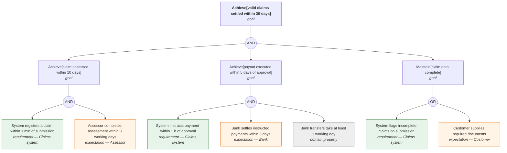
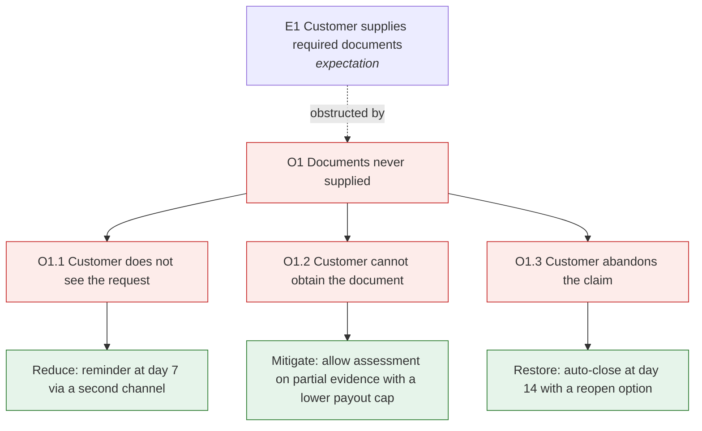
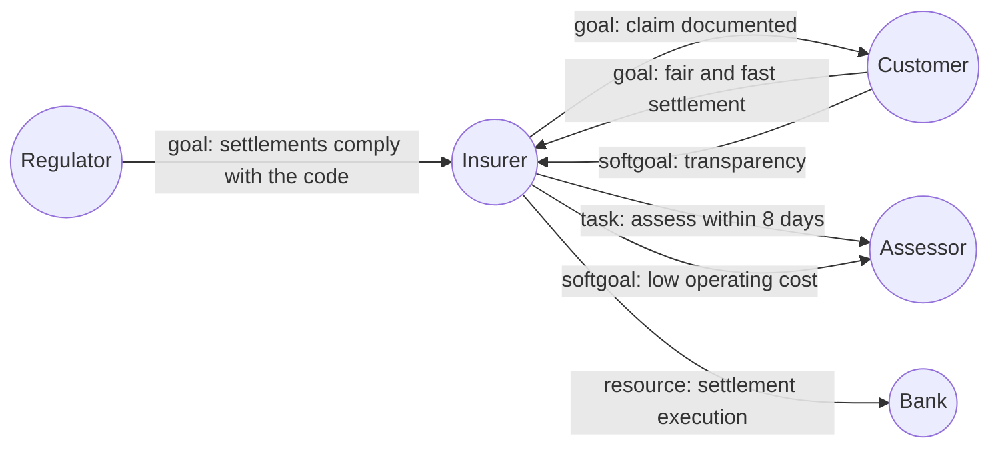

# Goal modeling — KAOS and i*

Goal of this skill: decompose "why are we building this" into a structure you can argue with — goals refined into sub-goals, down to **requirements** assigned to the system and **expectations** assigned to people or external parties — and make conflicts between stakeholders visible instead of leaving them to be discovered during acceptance.

Use this skill when requirements are contested, when several stakeholders want incompatible things, when you must justify why a requirement exists, in safety- or compliance-critical work where obstacles must be systematically analysed, or when a "requirement" turns out to be someone's solution to an unstated goal.

Do **not** use it for straightforward feature work (`impact-mapping` is lighter and usually enough) or when a measurable outcome and a clear owner already exist.

---

## 1. KAOS in one page

| Element | Meaning | Notation rule |
|---------|---------|---------------|
| **Goal** | A prescriptive statement of intent the system-and-environment should satisfy | `Achieve[…]`, `Maintain[…]`, `Avoid[…]` |
| **AND-refinement** | The goal is met if **all** sub-goals are met | Every sub-goal is necessary |
| **OR-refinement** | The goal is met if **any** alternative is met | Alternatives to be chosen between — the design space |
| **Requirement** | A leaf goal assigned to the **software** | Must be verifiable by the system |
| **Expectation** | A leaf goal assigned to an **agent in the environment** (person, external system) | Cannot be enforced by the software — it is an assumption |
| **Domain property** | Something true about the world regardless of us | Physics, law, business reality |
| **Agent** | Who or what is responsible for a leaf | Every leaf has exactly one |
| **Obstacle** | A condition that prevents a goal | Obtained by negating the goal and asking how |
| **Conflict** | Two goals that cannot both hold in some situation | Must be resolved explicitly |

Goal patterns:

| Pattern | Meaning | Example |
|---------|---------|---------|
| `Achieve[P]` | Eventually P holds | *Achieve[claim settled within 30 days]* |
| `Maintain[P]` | P always holds | *Maintain[personal data accessible only to authorised staff]* |
| `Avoid[P]` | P never holds | *Avoid[double payout for one claim]* |
| `Cease[P]` | P eventually stops holding | *Cease[account access after termination]* |

**Requirement vs expectation is the highest-value distinction in KAOS.** "The customer provides accurate documents" is not a requirement — it is an expectation, and every expectation is a risk that needs an obstacle analysis.

---

## 2. Obstacle analysis

For each leaf goal:

1. **Negate it.** What is the state in which this goal fails?
2. **Refine the negation** — how could that failure come about? Keep asking until you reach conditions you can act on.
3. **Assess** likelihood and severity.
4. **Resolve**, choosing a strategy:

| Strategy | Meaning | Example |
|----------|---------|---------|
| **Substitute goal** | Replace the goal with one not subject to the obstacle | Stop relying on the customer's stated address; verify it |
| **Prevent** | Make the obstacle impossible | Enforce the constraint at the boundary |
| **Reduce likelihood** | Make it rarer | Reminders before the deadline |
| **Mitigate** | Reduce the damage when it occurs | Manual fallback queue, compensating transaction |
| **Tolerate** | Accept it, with an owner | Documented and signed off |
| **Restore** | Detect and recover afterwards | Reconciliation job |

Obstacle analysis is where non-obvious requirements come from — it is the systematic version of "what could go wrong", and it feeds `risk-conflict-analysis` directly.

---

## 3. i* in one page

i* (i-star) models **intentional dependencies between actors** — who depends on whom, and how vulnerable that makes them.

| Element | Meaning |
|---------|---------|
| **Actor** | A stakeholder, role, or system with intentions |
| **Goal dependency** | A depends on B to achieve a goal; B decides how |
| **Task dependency** | A depends on B to perform a specific task in a specific way |
| **Resource dependency** | A depends on B to provide something |
| **Softgoal dependency** | A depends on B for a quality (security, usability, speed) with no clear-cut satisfaction criterion |
| **Contribution links** | How a task or goal affects a softgoal: `++` make, `+` help, `-` hurt, `--` break |

Two views: the **Strategic Dependency** model (actors and the dependencies between them) and the **Strategic Rationale** model (the reasoning inside one actor). For discovery, the dependency model plus softgoal contributions is usually enough.

Softgoal contribution analysis is what makes trade-offs visible: one design `++` security and `--` usability, another the reverse. That is a decision to be taken, not an argument to be won.

---

## 4. Intake — ask before modeling

Ask only what is missing; batch into one message, five or fewer.

1. **What is the top goal**, stated so someone could tell whether it holds?
2. **Which stakeholders** have a stake, and what does each of them want out of it?
3. **Where is the disagreement** you already know about?
4. **What is out of our control** — which parties must do things we cannot enforce?
5. **What must never happen** (safety, legal, financial), and what would the consequence be?

---

## 5. Method

1. **State the top goal** in a goal pattern. Refine it into sub-goals with AND/OR until each leaf is assignable to a single agent.
2. **Assign every leaf**: system → requirement; person or external system → expectation; world → domain property.
3. **Check every AND-refinement for completeness**: if all children hold and the domain properties hold, does the parent necessarily hold? If not, a child is missing.
4. **Check every OR-refinement**: are the alternatives genuinely exclusive options, and what are the criteria for choosing?
5. **Run obstacle analysis** on every leaf, prioritising expectations and safety-relevant goals.
6. **Model actor dependencies** (i*): who depends on whom, and for what kind of thing.
7. **Model softgoals and contributions** for quality concerns, and identify where two goals contribute in opposite directions.
8. **Register conflicts** and resolve them explicitly (see `risk-conflict-analysis` for the resolution strategies).
9. **Trace forward**: each requirement becomes a story, an acceptance criterion, or a quality attribute scenario. Nothing in the tree may be an orphan.

---

## 6. Output template

Write to `docs/discovery/goal-model-<scope>.md`.

````markdown
# Goal model — <Claims settlement>

- **Date**: <YYYY-MM-DD> · **Owner**: <name> · **Stakeholders**: <list>
- **Top goal**: `Achieve[valid claims settled within 30 days]`

## Goal refinement tree



## Leaves

| # | Statement | Type | Agent | Verifiable by | Traces to |
|---|-----------|------|-------|---------------|-----------|
| R1 | System registers a claim within 1 min of submission | requirement | Claims system | QA-2 performance scenario | STORY-310 |
| E1 | Customer supplies required documents | expectation | Customer | not enforceable — obstacle O1 | process step 3 |
| D1 | Bank transfers take at least 1 working day | domain property | world | — | constrains G2 |

## Obstacle analysis



| # | Obstructs | Obstacle | Likelihood | Severity | Strategy | Resolution | New requirement | Owner |
|---|-----------|----------|------------|----------|----------|------------|-----------------|-------|
| O1.1 | E1 | Customer does not see the request | high | medium | reduce | reminder at day 7 by SMS | R7 | Team A |

## Actor dependencies (i*)



| Depender | Dependee | Type | Dependum | Vulnerability if unmet | Mitigation |
|----------|----------|------|----------|------------------------|------------|
| Insurer | Customer | goal | claim documented | claim stalls; SLA missed | O1 resolutions |
| Insurer | Bank | resource | settlement execution | payout late; regulatory breach | retry + manual finance task |

## Softgoal contributions

| Design option | Fast settlement | Fraud control | Operating cost | Customer transparency | Verdict |
|---------------|-----------------|---------------|----------------|----------------------|---------|
| Auto-approve claims under €200 | ++ | -- | ++ | + | accepted with a monthly fraud review |
| Manual review of all claims | -- | ++ | -- | - | rejected |

## Conflicts

| # | Goal A | Goal B | Situation where they clash | Stakeholders | Resolution | Decided by | Date |
|---|--------|--------|----------------------------|--------------|------------|-----------|------|
| C1 | Achieve[settlement within 30 days] | Avoid[fraudulent payout] | Suspicious claim near the deadline | Ops vs Fraud | Deadline pauses on documented fraud suspicion; max 15 extra days | <name> | <date> |

## Traceability

| Goal / leaf | Realised by | Verified by |
|-------------|-------------|-------------|
| R1 | STORY-310 | acceptance criterion 2, load test LT-4 |

## Open questions

| # | Question | Owner | Due |
|---|----------|-------|-----|
````

---

## 7. Anti-patterns

| Anti-pattern | Consequence | Do instead |
|--------------|-------------|------------|
| Expectations recorded as requirements | You "implement" something you cannot control | Assign an agent to every leaf; environment leaves are expectations |
| Expectations without obstacle analysis | The dependency fails silently in production | Every expectation gets obstacles and resolutions |
| Refining until the leaves are already solutions | The design space is closed before it is examined | Refine goals; alternatives belong in OR branches |
| AND-refinements that do not actually entail the parent | Silent gap in the requirements | Completeness check per refinement |
| Softgoals treated as satisfiable/unsatisfiable | Endless argument about "secure enough" | Contribution links plus measurable scenarios (`quality-attributes`) |
| Conflicts averaged away in wording | The clash reappears in acceptance testing | Register and resolve explicitly, with a decider |
| A model with 200 nodes | Nobody maintains or reads it | Model only the contested and the safety-critical parts |
| No traceability to stories or tests | The model becomes a museum piece | Every leaf traces forward |
| Goal statements without a pattern | Ambiguity between "eventually" and "always" | Use `Achieve` / `Maintain` / `Avoid` / `Cease` |

---

## 8. Checklist

- [ ] Top goal stated in a goal pattern and verifiable in principle
- [ ] Refinements labelled AND or OR, never implied
- [ ] Every AND-refinement checked for completeness against domain properties
- [ ] OR alternatives have stated selection criteria
- [ ] Every leaf assigned to exactly one agent
- [ ] Requirements, expectations, and domain properties distinguished
- [ ] Obstacle analysis run on every expectation and every safety-critical requirement
- [ ] Each obstacle has a likelihood, a severity, a strategy, and an owner
- [ ] Actor dependencies modelled with the vulnerability if unmet
- [ ] Softgoals modelled with contribution links per design option
- [ ] Conflicts registered with the situation, the stakeholders, and the decision
- [ ] Every leaf traces forward to a story, a criterion, or a quality scenario
- [ ] Model scoped to what is contested or critical, not to everything
