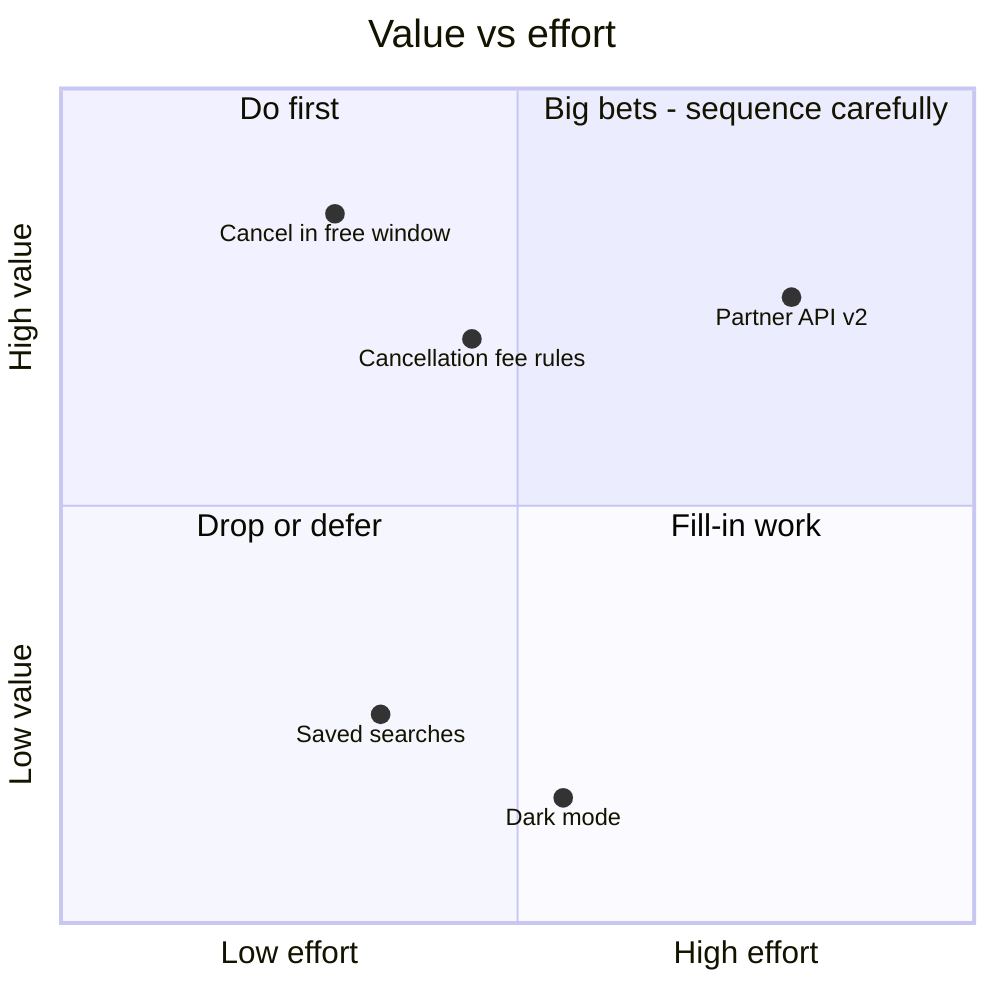

# Prioritisation

Goal of this skill: decide **what to build first** with a method whose assumptions are visible — so the ranking can be argued with on its inputs rather than on volume of opinion.

Use this skill for release scoping, backlog ordering, quarterly planning, and stakeholder negotiation when everything is "top priority".

Do **not** prioritise before the items trace to an outcome (`impact-mapping`) — ranking a list of unjustified features precisely is still ranking the wrong list. And do not prioritise items so large that they cannot be compared; split first (`user-stories`).

---

## 1. Choosing the method

| Method | Optimises for | Inputs needed | Best for | Weakness |
|--------|---------------|---------------|----------|----------|
| **MoSCoW** | A scope commitment for a fixed date | Team judgement, a deadline | Release scoping, contracts | Everything drifts to "must" without discipline |
| **WSJF** | Economic sequencing under a capacity constraint | Cost of delay components, job size | Ordering a queue of comparable items | Fake precision if the inputs are guesses |
| **Kano** | Deciding which features create satisfaction | Customer survey (functional/dysfunctional pairs) | Feature mix, differentiation | Needs real customer data; categories shift over time |
| **RICE / weighted scoring** | Comparable value per effort | Reach, impact, confidence, effort | Large mixed backlogs | Arbitrary weights become invisible policy |
| **Opportunity scoring** | Underserved outcomes | Importance and satisfaction per outcome (`jobs-to-be-done`) | Finding where to invest, not which feature | Needs a survey |
| **Buy a Feature** | Revealing stakeholder trade-offs | Priced feature list, group session | Conflicting stakeholders | Prices must be credible |
| **Prune the Product Tree** | Shaping growth and coherence | A drawn "tree", group session | Roadmap shape, what to remove | Qualitative |
| **Value vs effort grid** | Fast triage | Two rough axes | Quick sorting before a deeper method | Hides risk and dependencies |
| **Cost of delay alone** | Urgency and sequencing | Money over time | Deadlines, regulatory dates, market windows | Hard to estimate; do it in ranges |

Practical combination: triage with a value/effort grid → sequence the top band with WSJF → commit scope with MoSCoW → sanity-check the mix with Kano.

---

## 2. MoSCoW, done properly

| Category | Meaning | Discipline |
|----------|---------|------------|
| **Must** | Without it the release is not viable — legally, contractually, or functionally | Test: what happens if it ships without this? If the answer is "it is worse", it is a Should |
| **Should** | Important, painful to omit, but there is a workaround | |
| **Could** | Desirable if capacity allows | The buffer that makes the date achievable |
| **Won't (this time)** | Explicitly out of scope, recorded | The most valuable category — it stops re-litigation |

Rules: cap Musts at roughly 60 % of capacity, or the date is fiction; every Must names the consequence of omission; "Won't" items are written down with a revisit condition; re-rank at every iteration boundary, not once per release.

---

## 3. WSJF and cost of delay

`WSJF = Cost of Delay ÷ Job Size`, where `Cost of Delay = User/business value + Time criticality + Risk reduction / opportunity enablement`.

| Component | Ask |
|-----------|-----|
| **User/business value** | What do we gain or lose per unit time without it? |
| **Time criticality** | Does the value decay? Is there a fixed date, a market window, a regulatory deadline? |
| **Risk reduction / opportunity enablement** | Does it remove uncertainty or unlock other work? |
| **Job size** | Relative effort — a proxy for duration under a fixed capacity |

Practice: estimate each component on a modified Fibonacci scale (1, 2, 3, 5, 8, 13, 20) **relative to the other items**, and anchor each column by giving the smallest item a 1. Do it as a group, silently first, then discuss the outliers.

Where money is genuinely estimable, use real cost of delay in currency per week — a range, not a point. "Between €20k and €60k per week" is honest and still decides the ranking.

Honesty rule: **WSJF is a conversation structure, not a formula that decides for you.** If the top item feels wrong, examine the inputs rather than overriding the output silently.

---

## 4. Kano

Ask customers two questions per feature — functional ("how do you feel if it is present?") and dysfunctional ("how do you feel if it is absent?") — with the standard five answers, and classify:

| Category | Present | Absent | Investment rule |
|----------|---------|--------|-----------------|
| **Must-be (basic)** | Neutral | Very dissatisfied | Meet the standard; excellence here buys nothing |
| **Performance (one-dimensional)** | Satisfied in proportion | Dissatisfied in proportion | Invest where the slope is steepest |
| **Attractive (delighter)** | Delighted | Neutral | A small number differentiate; do not build a product only of these |
| **Indifferent** | Neutral | Neutral | Do not build |
| **Reverse** | Dissatisfied | Satisfied | Actively harmful — remove |

Remember the decay: today's delighter is tomorrow's basic. Re-run Kano periodically rather than trusting a two-year-old classification.

---

## 5. Participatory formats

**Buy a Feature** — give each stakeholder a budget, price each feature by its real cost, and make the expensive ones unaffordable alone so people must pool money. What they negotiate about reveals more than any survey. Run it with 6–8 stakeholders, prices credible enough that engineering will stand behind them, and 45 minutes of trading.

**Prune the Product Tree** — draw the product as a tree (trunk = core, branches = areas, leaves = features). Participants add leaves where they want growth and prune what should go. Excellent for roadmap *shape* and for making removal socially acceptable.

**Dot voting / 25-10 crowd sourcing** — fast narrowing before a deeper method; vote silently and simultaneously to avoid herding.

---

## 6. Intake — ask before prioritising

Ask only what is missing; batch into one message, five or fewer.

1. **What decision** — release scope, queue order, quarterly investment, or removing things?
2. **What is the constraint** — a fixed date, a fixed team, a fixed budget?
3. **What are the items**, and are they comparable in size? Do they trace to outcomes?
4. **Who decides**, and who must agree (`workshop-facilitation` decision protocol)?
5. **What data exists** — customer research, usage data, cost of delay estimates, dependencies?

---

## 7. Output templates

````markdown
# Prioritisation — <scope> — <date>

- **Decision**: <release scope / queue order> · **Constraint**: <date / capacity>
- **Method(s)**: value-effort triage → WSJF → MoSCoW · **Decider**: <name> · **Participants**: <names>

## Value vs effort triage



## WSJF

| Item | User/business value | Time criticality | Risk reduction | Cost of delay | Job size | **WSJF** | Rank |
|------|--------------------:|-----------------:|---------------:|--------------:|---------:|---------:|-----:|
| Cancel in free window | 8 | 5 | 3 | 16 | 3 | **5.3** | 1 |
| Cancellation fee rules | 5 | 5 | 2 | 12 | 3 | **4.0** | 2 |
| Partner API v2 | 8 | 13 | 5 | 26 | 13 | **2.0** | 3 |
| Saved searches | 3 | 1 | 1 | 5 | 5 | **1.0** | 4 |

**Anchors**: value 1 = "saved searches"; size 1 = "copy change". **Estimated by**: group, silent first, outliers discussed.

## MoSCoW commitment for <release>

| Priority | Item | Consequence if omitted | Capacity |
|----------|------|------------------------|----------|
| Must | Cancel in free window | Support load target missed; the release has no point | 3 |
| Must | Audit log of state changes | Compliance breach | 2 |
| Should | Cancellation fee rules | Agents handle the 24 h cases manually — workaround exists | 3 |
| Could | Mobile boarding pass | — | 5 |
| Won't (this time) | Group changes | Revisit when partner volume exceeds 500/month | — |

**Capacity check**: Musts 5 of 13 points ≈ 38 % — within the 60 % guideline.

## Kano classification

| Feature | Category | Sample | Investment decision |
|---------|----------|--------|---------------------|
| Instant cancellation confirmation | must-be | n=180 | meet the standard, do not over-invest |
| Refund breakdown before confirming | performance | n=180 | invest — steepest slope |
| Proactive rebooking suggestion | attractive | n=180 | one delighter for this release |
| In-app chat | indifferent | n=180 | do not build |

## Decisions and dissent

| # | Decision | Rationale | Dissent recorded |
|---|----------|-----------|------------------|
| 1 | Partner API v2 deferred to R3 | Highest cost of delay but 13 points; would consume the release | Partner manager disagrees — revisit at <date> |

## Revisit trigger

<what would change this ranking, and when it is next reviewed>
````

---

## 8. Anti-patterns

| Anti-pattern | Consequence | Do instead |
|--------------|-------------|------------|
| Everything is a Must | The date is fiction; the team decides scope by exhaustion | Cap Musts; state the consequence of omission for each |
| Scoring theatre — precise numbers from guesses | False confidence, unarguable output | Estimate relatively, anchor the scales, record confidence |
| Prioritising an unjustified list | Precisely ordered wrong work | Trace items to outcomes first |
| Items of wildly different sizes compared directly | Big items always lose or always win | Split to comparable sizes first |
| Ignoring cost of delay decay | Late delivery of time-critical items | Time criticality as an explicit component |
| Kano from the team's opinion | You classify your own preferences | Kano needs customer responses |
| Weighted scoring with hidden weights | Policy embedded invisibly | Publish weights and who set them |
| One-off prioritisation | Ranking obsolete within weeks | Re-rank at iteration boundaries; define revisit triggers |
| Ignoring dependencies and enablers | Top-ranked item blocked by an unranked one | Model dependencies before committing the order |
| Loudest stakeholder wins | Resentment and shadow backlogs | Participatory format with an announced decision protocol |
| No "Won't" list | The same items return every planning round | Record them with a revisit condition |

---

## 9. Checklist

- [ ] Decision and constraint stated before choosing a method
- [ ] Items trace to outcomes and are comparable in size
- [ ] Method chosen deliberately and named in the output
- [ ] Estimation scales anchored, and estimates made silently before discussion
- [ ] Cost of delay decomposed into value, time criticality, and risk reduction
- [ ] Confidence and data source recorded per input
- [ ] Musts capped and each justified by the consequence of omission
- [ ] "Won't this time" recorded with revisit conditions
- [ ] Dependencies and enablers accounted for in the ordering
- [ ] Kano classifications based on customer data, with sample size
- [ ] Decision protocol announced; decider named
- [ ] Dissent recorded rather than smoothed over
- [ ] Revisit trigger and next review date set
