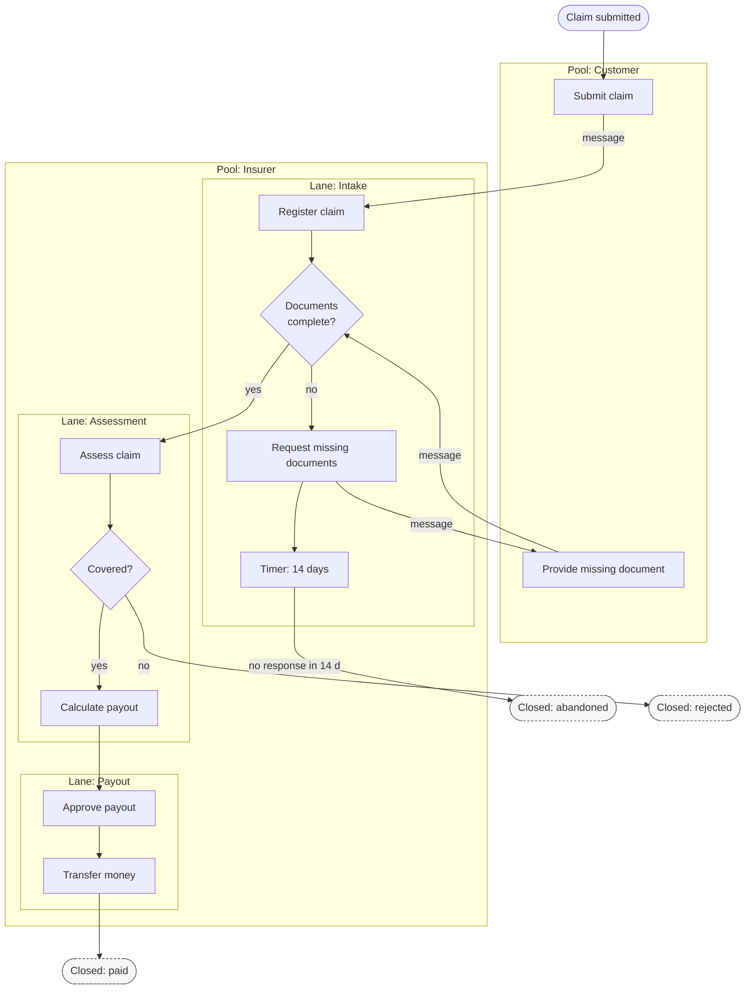
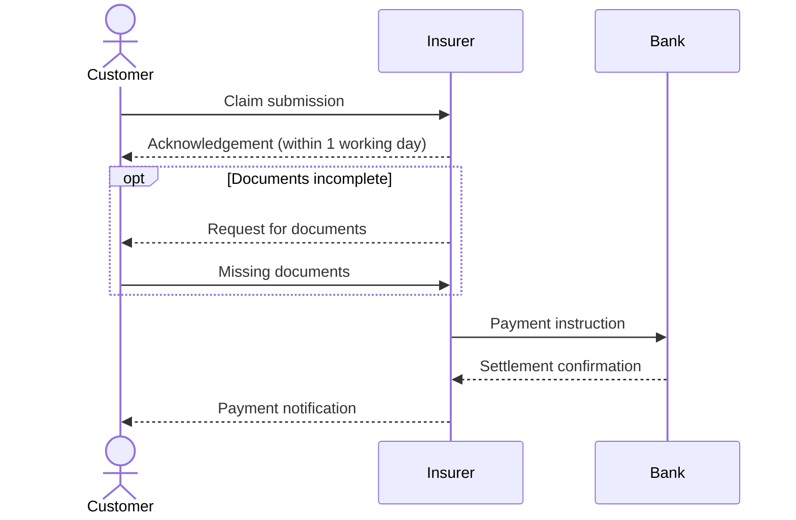

# Process modeling — BPMN and activity diagrams

Goal of this skill: make a process **executable in the mind of every reader** — who does what, in which order, what decides the branches, what happens when it goes wrong, and where work crosses an organisational boundary.

Use this skill for processes with real handoffs and exceptions (claims, irregular operations, approvals, onboarding, returns), when a process spans several roles or companies, when you need to show the difference between the documented and the actual process, or when automation candidates must be identified.

Do **not** use it to explore an unknown domain (`event-storming` first), to model the lifecycle of a single entity (`state-machines`), or to specify one actor's interaction with a system (`use-case-modeling`).

---

## 1. The BPMN subset worth using

Full BPMN has over 100 symbols. Almost every useful model needs about a dozen. Agree the subset with your audience and put a legend on the diagram.

| Element | Meaning | Use |
|---------|---------|-----|
| **Start event** (thin circle) | What triggers the process | Exactly one per pool, named after the trigger |
| **End event** (thick circle) | An outcome | Several are normal — name each outcome |
| **Task** (rounded box) | A unit of work | Verb + object: *Check eligibility* |
| **User task / service task** | Human vs automated | Marks automation candidates |
| **Exclusive gateway** (diamond, X) | Exactly one path | Label the diamond with a question, label each outgoing path with the answer |
| **Parallel gateway** (diamond, +) | All paths, concurrently | Must be joined by a matching parallel gateway |
| **Inclusive gateway** (diamond, O) | One or more paths | Use sparingly — hard to reason about |
| **Event-based gateway** | The next event decides | Waiting for a response or a timeout |
| **Timer event** | Deadline, delay, escalation | The most under-used element in real processes |
| **Message event** | Communication across pools | Every cross-pool arrow is a message |
| **Error event / boundary event** | Something failed inside a task | Attach to the task it interrupts |
| **Subprocess** (box with +) | A collapsed detail level | Keeps the top level readable |
| **Pool** | An organisation or a participant | Separate pools do not share control flow — only messages |
| **Lane** | A role inside a pool | Every task sits in exactly one lane |

Sequence flow may not cross a pool boundary. Between pools, only **messages** travel. Getting this right is what makes cross-company processes honest.

---

## 2. Intake — ask before modeling

Ask only what is missing; batch into one message, five or fewer.

1. **Which process**, and where does it start and end? Name the trigger and every outcome you know.
2. **AS-IS or TO-BE?** If both, we model them separately and diff them.
3. **Who is involved** — roles inside your organisation (lanes) and external parties (pools)?
4. **What goes wrong** — which exceptions, refusals, timeouts, escalations and irregular paths matter? What is the frequency of each?
5. **What is the model for** — automation, compliance evidence, training, system design, or a handover analysis?

If the answer to (4) is "nothing much goes wrong", ask again with examples — the exception paths are usually 80 % of the real work and the reason the model is being drawn.

---

## 3. Method

1. **Happy path first, one lane at a time.** Get the main flow from trigger to primary outcome, 7–15 tasks. Anything longer is a candidate for subprocesses.
2. **Add roles.** Assign each task to a lane. Every lane change is a **handoff** — mark it; handoffs are where time and information are lost.
3. **Add decisions.** Every gateway gets a question and fully labelled outgoing paths. Paths must be exhaustive: add the "neither" branch.
4. **Add the irregular flows.** For each task ask: what if it fails, is refused, times out, arrives twice, or arrives out of order? Model the ones that matter; list the rest in a table.
5. **Add timers and escalations.** Every wait state needs a maximum duration and an escalation path. "We just wait" is a design decision, so make it visible.
6. **Add data and systems.** Which system holds the truth at each step; which document is produced.
7. **Mark measurements.** Process time, wait time, volume, and error rate per step — this is where the improvement case comes from.
8. **Mark automation candidates.** Manual tasks that are high-volume, rule-based and low-judgement.
9. **Validate by walking through real cases** — a normal one, a rare one, and the worst one anybody remembers.

---

## 4. Mermaid vs real BPMN

Mermaid has no BPMN notation. It is excellent for reviewable, version-controlled process documentation in a repository; it is not a substitute for an executable BPMN 2.0 model.

| Need | Use |
|------|-----|
| Process documentation in Git, reviewed in pull requests | **Mermaid flowchart** with subgraph lanes (below) |
| Cross-organisation message exchange | **Mermaid sequenceDiagram** (pools as participants) |
| Executable process on a BPMN engine (Camunda, Flowable, Zeebe) | **BPMN 2.0 XML** authored in bpmn.io / Camunda Modeler, stored next to the Markdown |
| Formal compliance artifact | BPMN 2.0, with the Markdown as the readable companion |

Convention that works well: keep the `.bpmn` file in the repository, and keep the Markdown document with a Mermaid overview, the step table, the exception table, and the measurements. The Markdown is what people read; the BPMN is what the engine runs.

---

## 5. Output template

Write to `docs/discovery/process-<slug>.md`.

````markdown
# Process — <name> (<AS-IS | TO-BE>)

- **Date**: <YYYY-MM-DD> · **Owner**: <process owner> · **Modeller**: <name>
- **Trigger**: <event that starts it> · **Outcomes**: <outcome 1>, <outcome 2>, …
- **Source**: <interviews / observation / BPMN file `process.bpmn`>
- **Scope note**: happy path plus exceptions E1–E4; rare paths listed but not drawn

## Overview



## Steps

| # | Task | Lane / role | System | Input | Output | Process time | Wait time | Volume/day | Automation candidate |
|---|------|-------------|--------|-------|--------|--------------|-----------|------------|----------------------|
| 1 | Register claim | Intake | Claims system | claim form | claim record | 4 min | 0 | 320 | yes (OCR + validation) |
| 2 | Request missing documents | Intake | Email | claim record | request email | 3 min | 2–14 d | 90 | yes (template + reminder) |

## Decisions

| Gateway | Question | Rule / criteria | Owner of the rule | Source |
|---------|----------|-----------------|-------------------|--------|
| I2 | Documents complete? | Policy number, incident date, and at least one photo present | Claims policy §3 | `document-system-analysis` S4 |

## Handoffs

| # | From role | To role | What is handed over | Channel | Loss / delay observed |
|---|-----------|---------|--------------------|---------|----------------------|
| H1 | Intake | Assessment | claim record + documents | claims system queue | avg 1.5 d wait, priority not visible |

## Exceptions and irregular flows

| # | At step | Condition | Frequency | Handling today | Modelled? | Desired handling |
|---|---------|-----------|-----------|----------------|-----------|------------------|
| E1 | 3 | Customer never responds | 12 %/month | closed after 14 d timer | yes | reminder at 7 d before closing |
| E2 | 5 | Suspected fraud | 2 %/month | manual escalation by phone | no | route to fraud lane with SLA |
| E3 | 7 | Payment rejected by the bank | 0.4 %/month | finance corrects manually | no | automatic retry, then manual task |

## Timers and escalations

| Wait state | Max duration | On expiry | Notified |
|------------|--------------|-----------|----------|
| Waiting for documents | 14 days | close as abandoned | customer, intake |

## Cross-organisation messages



## Measurements

| Metric | Current | Target | Source |
|--------|---------|--------|--------|
| End-to-end lead time (p50 / p90) | 6 d / 21 d | 3 d / 10 d | claims system export <date> |
| Rework rate (documents requested twice) | 9 % | < 3 % | ticket analysis |

## Improvement opportunities

| # | Opportunity | Step | Expected effect | Effort | Owner |
|---|-------------|------|-----------------|--------|-------|

## Open questions

| # | Question | Owner | Due |
|---|----------|-------|-----|
````

---

## 6. Anti-patterns

| Anti-pattern | Consequence | Do instead |
|--------------|-------------|------------|
| Happy path only | The model describes 20 % of the real work | Model the exceptions that matter; list the rest |
| Sequence flow crossing pool boundaries | Implies control you do not have over another party | Only messages between pools |
| Unlabelled gateway paths | Readers guess the branch conditions | Question on the diamond, answer on every arrow |
| Non-exhaustive branches | The "neither" case is undefined in production | Add the default branch explicitly |
| Wait states with no timer | Work stalls invisibly | Every wait gets a maximum and an escalation |
| Modeling the TO-BE without an AS-IS | No baseline, no evidence for the change | Model both, diff them |
| One diagram with 60 tasks | Nobody reads it | Subprocesses; top level under ~15 tasks |
| Roles missing, only system steps | Handoffs — the main source of delay — become invisible | Lanes for every role |
| Model without volumes and times | No case for improvement or automation | Measure per step |
| Mermaid used as an executable model | Silent drift from what the engine runs | BPMN 2.0 for execution, Markdown for reading |
| Model produced by IT and never validated | Documented fiction | Walk real cases with the people who run them |

---

## 7. Checklist

- [ ] Trigger and every end outcome named
- [ ] AS-IS and TO-BE separated
- [ ] Every task assigned to a lane; external parties in their own pools
- [ ] Only messages cross pool boundaries
- [ ] Every gateway has a question and fully labelled, exhaustive branches
- [ ] Exception and irregular paths enumerated with frequency, drawn where they matter
- [ ] Every wait state has a maximum duration and an escalation path
- [ ] Handoffs marked with channel and observed delay
- [ ] Process time, wait time, and volume captured per step
- [ ] Automation candidates identified with a reason
- [ ] Systems and documents attached to the steps that use them
- [ ] Model walked through with a normal, a rare, and a worst-case real example
- [ ] Executable BPMN file referenced if one exists; Markdown kept as the readable companion
