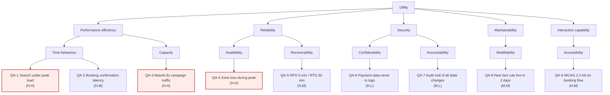

# Quality attribute workshops and ISO 25010

Goal of this skill: turn "it must be fast, secure and reliable" into **measurable, testable scenarios** that drive architecture — and make the trade-offs between them explicit before they are decided by accident.

Use this skill before architectural decisions, when non-functional requirements are vague or absent, when the architecture is being evaluated or replaced, when SLAs must be defined, or when performance and security keep arriving as afterthoughts.

Do **not** use it to gather functional requirements (`use-case-modeling`, `user-stories`) or to justify scope (`impact-mapping`).

---

## 1. The core artifact: the six-part scenario

An unmeasurable quality requirement is a wish. Every quality attribute requirement is written as a scenario with six parts:

| Part | Question | Example |
|------|----------|---------|
| **Source** | Who or what triggers it? | 5,000 concurrent customers |
| **Stimulus** | What arrives? | Submit a booking search |
| **Artifact** | Which part of the system? | Search API and inventory cache |
| **Environment** | Under which conditions? | Peak sales hour, one availability zone lost |
| **Response** | What should happen? | Results returned, or a degraded cached result |
| **Response measure** | Measured how, to what threshold? | p95 ≤ 800 ms, p99 ≤ 2 s, error rate < 0.5 % |

If you cannot write the response measure, you do not yet have a requirement — you have a topic. Say so explicitly rather than writing "should be fast".

---

## 2. ISO/IEC 25010 as an elicitation checklist

Walk the characteristics; ask for a scenario per relevant sub-characteristic. The value of the standard here is coverage — it stops the workshop from producing only performance and security.

| Characteristic | Sub-characteristics | Typical scenario prompt |
|----------------|--------------------|-------------------------|
| **Functional suitability** | completeness, correctness, appropriateness | Where would a partially correct result be dangerous? |
| **Performance efficiency** | time behaviour, resource utilisation, capacity | What is the peak load, and what latency is unacceptable? |
| **Compatibility** | co-existence, interoperability | Which systems and formats must it work with? |
| **Interaction capability** (usability) | learnability, operability, accessibility, error protection, user assistance | Who must be able to use it without training? Which accessibility level is binding? |
| **Reliability** | maturity, availability, fault tolerance, recoverability | Availability target? RTO/RPO? Behaviour when a dependency is down? |
| **Security** | confidentiality, integrity, non-repudiation, accountability, authenticity | What must never leak, and what must be provable afterwards? |
| **Maintainability** | modularity, reusability, analysability, modifiability, testability | Which change must be cheap? How fast must a defect be diagnosable? |
| **Flexibility** (portability) | adaptability, installability, replaceability, scalability | Which growth must it absorb without redesign? Which vendor must be replaceable? |
| **Safety** | operational constraint, risk identification, fail-safe, hazard warning | What is the safe state on failure? |

Note the 2023 revision: *usability* became **interaction capability**, *portability* became **flexibility**, and **safety** was added as a top-level characteristic. Cite which edition you are using.

---

## 3. Quality Attribute Workshop — the session

**Participants**: architects, developers, operations, security, business owner, and — critically — a user representative and someone who supports the system in production. 8–15 people, half a day.

| Step | Time | Activity |
|------|------|----------|
| 1 | 15 min | Business drivers presented by the sponsor — goals, constraints, what failure would cost |
| 2 | 15 min | Architecture plan presented (as it stands, even if rough) |
| 3 | 20 min | Quality attribute walk-through using the ISO 25010 checklist |
| 4 | 45 min | **Scenario brainstorming** — silent writing first, one scenario per card, no filtering |
| 5 | 20 min | Consolidation — merge duplicates, split compound scenarios |
| 6 | 25 min | **Prioritisation** — two votes per scenario: business importance (H/M/L) and technical difficulty/risk (H/M/L) |
| 7 | 45 min | **Refinement** — take the `(H,H)` scenarios and write all six parts, with numbers |
| 8 | 15 min | Assign owners, identify what must be measured or prototyped to know the current value |

Rule: **numbers come from the business, not from the architects.** "How many seconds before a user abandons the search?" is a business question. Architects then say what it costs.

---

## 4. Utility tree

Organise scenarios into a tree: quality attribute → sub-characteristic → concrete scenario, each tagged `(business importance, technical difficulty)`. The `(H,H)` leaves are what the architecture must be designed and evaluated against; everything else is documented but not architecturally driving.

---

## 5. ATAM-lite — evaluating the architecture against the scenarios

For each high-priority scenario, walk the architecture and record:

| Concept | Meaning | Why it matters |
|---------|---------|----------------|
| **Architectural approach / tactic** | What in the design addresses this scenario | Caching, replication, bulkheads, rate limiting, CQRS, circuit breaker |
| **Sensitivity point** | A decision that strongly affects one attribute | Cache TTL determines both latency and staleness |
| **Trade-off point** | A decision that affects two or more attributes in opposite directions | Synchronous validation: integrity up, latency up |
| **Risk** | A decision or gap that endangers a scenario | No backpressure on the ingest queue |
| **Non-risk** | An explicitly checked, acceptable decision | Worth recording so it is not re-litigated |

Common trade-off pairs to probe deliberately: latency ↔ consistency, availability ↔ consistency, security ↔ usability, performance ↔ modifiability, cost ↔ redundancy, flexibility ↔ simplicity.

---

## 6. Intake — ask before the workshop

Ask only what is missing; batch into one message, five or fewer.

1. **What is the system**, and what would failure cost the business — in money, reputation, or legal terms?
2. **What load and growth** do you expect — current volumes, peaks, and the 2–3 year projection?
3. **What is legally or contractually binding** — SLAs, accessibility level, data residency, retention, certification?
4. **What is the current pain** — where does the existing system already fail on quality?
5. **Which architectural decisions are still open**, and which are fixed?

If a stakeholder answers "as fast as possible" or "100 % available", convert it: *"At what point does a user give up?"* and *"What does one hour of downtime cost, and what is the budget for avoiding it?"*

---

## 7. Output template

Write to `docs/architecture/quality-attributes-<system>.md`.

````markdown
# Quality attributes — <Booking Platform>

- **Date**: <YYYY-MM-DD> · **Facilitator**: <name> · **Participants**: <roles>
- **Standard**: ISO/IEC 25010:2023 · **Architecture reviewed**: `c4-booking-platform.md` @ <date>

## Business drivers

| # | Driver | Consequence of failure | Source |
|---|--------|------------------------|--------|
| B1 | Sales peak on campaign days is 8× normal | Lost revenue, ~€40k/hour | Commercial <name> |

## Utility tree



Tags are `(business importance, technical difficulty)`. Highlighted leaves are the `(H,H)` scenarios the architecture is designed and evaluated against.

## Scenarios

### QA-1 — Search under peak load · (H,H)

| Part | Value |
|------|-------|
| Source | 5,000 concurrent customers |
| Stimulus | Submit a booking search |
| Artifact | Search API, inventory cache |
| Environment | Campaign peak hour, normal operation |
| Response | Results returned, or cached results marked as possibly stale |
| Response measure | p95 ≤ 800 ms, p99 ≤ 2 s, error rate < 0.5 %, no request queued > 5 s |

- **ISO 25010**: performance efficiency / time behaviour
- **Source**: Commercial <name>, driver B1
- **Current value**: p95 1.9 s at 1,200 concurrent (load test LT-2, <date>)
- **Verified by**: load test LT-4 in CI, weekly; production p95 dashboard
- **Tactics**: read-through cache with 30 s TTL, connection pooling, autoscaling on RPS
- **Risks**: cache stampede on TTL expiry at peak — see R2

### QA-4 — Zone loss during peak · (H,H)

| Part | Value |
|------|-------|
| Source | Cloud provider |
| Stimulus | One availability zone becomes unreachable |
| Artifact | Booking API, database, event bus |
| Environment | Campaign peak hour |
| Response | Service continues in the remaining zones; no confirmed booking is lost |
| Response measure | Recovery within 60 s; zero loss of confirmed bookings; degraded search allowed for ≤ 5 min |

## Trade-offs and sensitivity points

| # | Decision | Affects positively | Affects negatively | Type | Chosen value | Rationale | ADR |
|---|----------|--------------------|--------------------|------|--------------|-----------|-----|
| T1 | Inventory cache TTL | latency (QA-1) | staleness / correctness | trade-off | 30 s | Overbooking risk acceptable below 60 s per Commercial | ADR-014 |
| T2 | Synchronous fraud check at booking | integrity, fraud control | latency (QA-2) | trade-off | async with a hold on high-risk | keeps p95 within budget | ADR-017 |
| S1 | Number of DB replicas | availability (QA-4) | cost | sensitivity | 3 across zones | meets RTO within budget | ADR-011 |

## Risks and non-risks

| # | Type | Statement | Affects | Severity | Action | Owner |
|---|------|-----------|---------|----------|--------|-------|
| R2 | risk | No stampede protection on cache expiry | QA-1, QA-3 | high | add request coalescing + jittered TTL | Team A |
| N1 | non-risk | Single-region deployment accepted; all customers in one market | QA-4 | — | revisit if a second market opens | — |

## Constraints (given, not negotiable)

| # | Constraint | Type | Source |
|---|-----------|------|--------|
| K1 | Personal data stays within the EU | legal | GDPR / company policy |
| K2 | WCAG 2.2 AA for public flows | legal | EAA, in force 2025-06-28 |

## Measurement plan

| Scenario | Metric | Where measured | Frequency | Alert threshold | Owner |
|----------|--------|----------------|-----------|-----------------|-------|
| QA-1 | search p95 | production APM + CI load test | continuous / weekly | p95 > 800 ms for 5 min | Team A |

## Open questions

| # | Question | Owner | Due |
|---|----------|-------|-----|
````

---

## 8. Anti-patterns

| Anti-pattern | Consequence | Do instead |
|--------------|-------------|------------|
| "The system shall be fast / secure / user-friendly" | Untestable; argued about forever | Six-part scenario with a response measure |
| Averages only (`avg 200 ms`) | Hides the tail that users actually feel | Percentiles: p50, p95, p99 |
| "100 % availability" | Unbudgeted, unachievable | Ask what an hour of downtime costs; pick a tier |
| Numbers invented by architects | No business backing; cut at the first deadline pressure | Business states the threshold, architects state the cost |
| Only performance and security elicited | Maintainability, accessibility, operability forgotten until they hurt | Walk the full ISO 25010 checklist |
| No current-value measurement | You cannot tell whether you have a problem | Measure the baseline before designing |
| Quality requirements never tested | They quietly stop holding | Every scenario names its verification method |
| Trade-offs decided implicitly in code | The organisation never chose | Record trade-off points and the decision in an ADR |
| Constraints listed as requirements | Effort wasted "deciding" what is already fixed | Separate the constraints section |
| Workshop without an operator or a support person | The scenarios miss what fails in production | Invite the people who carry the pager |

---

## 9. Checklist

- [ ] Business drivers stated, with the cost of failure
- [ ] Full ISO 25010 characteristic list walked, not just performance and security
- [ ] Every scenario has all six parts
- [ ] Response measures use percentiles and explicit thresholds
- [ ] Thresholds sourced from the business, with a named source
- [ ] Scenarios prioritised on business importance × technical difficulty
- [ ] `(H,H)` scenarios refined in full; others recorded but not architecturally driving
- [ ] Current measured value recorded per high-priority scenario
- [ ] Verification method named for every scenario
- [ ] Architectural tactics linked to the scenarios they serve
- [ ] Sensitivity and trade-off points documented with the chosen value and an ADR link
- [ ] Risks and explicit non-risks recorded
- [ ] Given constraints separated from negotiable requirements
- [ ] Measurement and alerting plan assigned to owners
