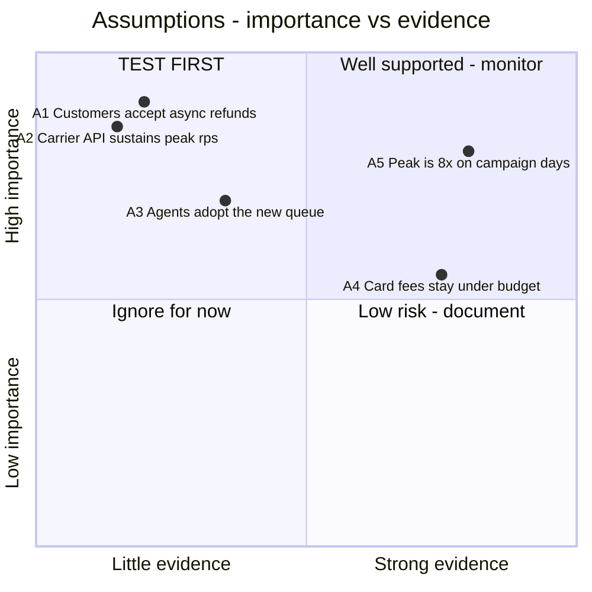

# Conflict, feasibility, and risk analysis

Goal of this skill: find the contradictions, the infeasible expectations, and the unexamined assumptions **while they are still cheap** — during discovery, not during acceptance testing.

Use this skill after any elicitation activity produces a requirement set, before committing to a scope or an architecture, when stakeholders want incompatible things, or when a plan depends on assumptions nobody has tested.

Do **not** use it as a replacement for the elicitation itself — you can only analyse what has been gathered.

---

## 1. Conflict analysis

### Types of conflict

| Type | Example | Usually resolved by |
|------|---------|--------------------|
| **Goal conflict** | Fast settlement vs thorough fraud checking | An explicit trade-off decision with a rule |
| **Quality trade-off** | Strong consistency vs low latency | Quantify both, decide per use case (`quality-attributes`) |
| **Resource conflict** | Two teams need the same specialist in the same quarter | Sequencing or reprioritisation |
| **Terminology conflict** | "Order" means two different things | Bounded contexts and a translation rule (`context-mapping`) |
| **Stakeholder priority conflict** | Sales wants speed to market, Legal wants certification first | Escalation with a named decider |
| **Constraint conflict** | GDPR erasure vs seven-year retention | Legal interpretation; usually a scoped exception |
| **Temporal conflict** | Two requirements that cannot hold at the same moment | Explicit precedence rule |
| **Implicit conflict** | Two requirements that only clash in a rare situation | Scenario analysis to surface it |

The dangerous class is the last one: requirements that look compatible on paper and collide only in a specific case. Find them by walking scenarios, not by reading the list.

### Detection

1. **Pairwise check within a theme.** For each pair of requirements in the same area, ask: is there a situation where satisfying one prevents the other?
2. **Cross-stakeholder check.** Where two stakeholders described the same behaviour differently, treat the difference as a conflict, not a wording issue.
3. **Trace to goals.** Requirements serving opposing goals in a `goal-modeling` tree are conflict candidates by construction.
4. **Walk the edge scenarios**: peak load, partial failure, the fraud case, the VIP customer, the regulator's audit, the day before a deadline.
5. **Compare against constraints.** Any requirement that violates a hard constraint is a conflict with reality, and reality wins.

### Resolution strategies

| Strategy | Meaning | When |
|----------|---------|------|
| **Prioritise** | One requirement wins outright | Clear business ranking exists |
| **Scope-separate** | Both hold, in different contexts or segments | Different customer tiers, different markets |
| **Sequence** | Both hold, at different times | One now, one after a milestone |
| **Weaken** | Relax one threshold until they coexist | Quantified quality attributes |
| **Precedence rule** | An explicit rule decides which wins in the clash situation | Fraud suspicion pauses the settlement clock |
| **Elevate** | A higher goal that both serve reframes the choice | Ladder up to the shared outcome |
| **Escalate** | A named decider decides | Genuine value conflicts with no analytical answer |
| **Defer with a trigger** | Postpone, with the condition that reopens it | Low likelihood of it mattering soon |

Every resolution is recorded with the decider, the date, and the losing party's position. A conflict "resolved" by rewording reappears in acceptance testing.

---

## 2. Feasibility analysis

Run a coarse check early and a deeper one before committing. Five dimensions:

| Dimension | Questions | Evidence that settles it |
|-----------|-----------|--------------------------|
| **Technical** | Can it be built with available technology and skills? What is unproven? | Spike, prototype, load test, vendor proof |
| **Operational** | Can it be run and supported? Who carries the pager? Does the process fit how people work? | Ops review, runbook draft, `contextual-inquiry` findings |
| **Economic** | Does the value exceed build plus run cost? What is the ongoing cost? | Cost model, licence quotes, cloud estimate |
| **Legal / regulatory** | Is it permitted? What does compliance cost? Which approvals are needed? | Legal opinion, DPIA, certification path |
| **Schedule** | Can it be done in the window, given dependencies? | Dependency map, lead times, vendor timelines |

Verdicts: **feasible** · **feasible with conditions** (list them) · **not feasible as stated** (state what would have to change) · **unknown — needs a spike** (with a timebox and a decision criterion).

Do this while the requirement can still be changed. Feasibility discovered during implementation is not analysis, it is damage.

---

## 3. Risk analysis

### Surfacing risks

| Technique | How | Best at finding |
|-----------|-----|-----------------|
| **Pre-mortem** | "It is a year later and this failed. Write down why." Silent writing first, then cluster | Organisational and political risks people will not raise directly |
| **Risk storming** | Everyone places risk notes on the architecture diagram individually, then compares | Technical risks, and where perceptions differ |
| **Assumption mapping** | Plot assumptions on importance × evidence | Unexamined beliefs the plan rests on |
| **Obstacle analysis** | Negate each goal systematically (`goal-modeling`) | Requirement-level failure modes |
| **Dependency review** | Walk every external party and system | Supply and integration risk |
| **Historical review** | What went wrong in comparable past projects here? | The organisation's recurring failure modes |

Individual, silent generation before discussion is what makes these work — group discussion first suppresses the risks that are politically uncomfortable.

### Assessing and treating

Score **likelihood × impact**, keep the scale explicit and consistent, and record the **detectability** — a risk you would notice immediately is not the same as one you would discover a year later.

| Response | Meaning | Example |
|----------|---------|---------|
| **Avoid** | Change the plan so the risk cannot occur | Drop the dependency |
| **Reduce** | Lower likelihood or impact | Prototype the unproven part first |
| **Transfer** | Move it to someone contractually equipped | Insurance, vendor SLA with penalties |
| **Accept** | Live with it, with a named owner | Documented, with a trigger to revisit |
| **Contingency** | Pre-agreed plan if it materialises | Fallback provider, manual process |

Every risk gets an **owner**, a **review date**, and a **trigger** — the observable signal that it is materialising. A risk register without triggers is a list nobody looks at.

**Assumption mapping** (Bland): plot each assumption on *importance* (how badly the plan breaks if it is wrong) against *evidence* (how much you actually know). The high-importance, low-evidence quadrant is your test backlog — and the cheapest experiment that could disprove each one is the next thing to run.

---

## 4. Intake — ask before analysing

Ask only what is missing; batch into one message, five or fewer.

1. **Which requirement set or plan** is being analysed, and where is it?
2. **What is already known to be contested**, and between whom?
3. **What is unproven** — technology, vendor, volume, skill, or legal position?
4. **What are the hard constraints** — budget, deadline, legal, existing systems?
5. **Who decides** when a conflict cannot be resolved analytically, and what is the escalation path?

---

## 5. Output template

Write to `docs/discovery/risk-conflict-<scope>.md`.

````markdown
# Conflict, feasibility, and risk analysis — <scope>

- **Date**: <YYYY-MM-DD> · **Analyst**: <name> · **Reviewed with**: <names>
- **Input**: <requirement set / goal model / architecture> @ <version>
- **Next review**: <YYYY-MM-DD>

## 1. Conflicts

| # | Requirement A | Requirement B | Type | Clash situation | Stakeholders | Strategy | Resolution | Decider | Date | Status |
|---|---------------|---------------|------|-----------------|--------------|----------|------------|---------|------|--------|
| C1 | Settle valid claims within 30 days | Never pay a fraudulent claim | goal | Suspicious claim near day 28 | Ops vs Fraud | precedence rule | Clock pauses on documented suspicion, max +15 days; customer informed | <name> | <date> | resolved |
| C2 | Erase personal data on request | Retain claim records for 7 years | constraint | Erasure request on an open claim | DPO vs Finance | scope-separate | Erase contact data, pseudonymise the claim record, keep financials | Legal | <date> | resolved |

### Unresolved conflicts

| # | Conflict | Why unresolved | Blocks | Decider | Due |
|---|----------|----------------|--------|---------|-----|

## 2. Feasibility

| # | Requirement / plan element | Technical | Operational | Economic | Legal | Schedule | Verdict | Conditions / next step |
|---|---------------------------|-----------|-------------|----------|-------|----------|---------|------------------------|
| F1 | Real-time fraud scoring at booking | unknown | ok | €? | DPIA needed | tight | **unknown — spike** | 5-day spike: latency at 300 rps; decision criterion p95 < 150 ms |
| F2 | Same-day payout | ok | not ok — no weekend finance cover | ok | ok | ok | **feasible with conditions** | weekend on-call rota, or same-day on working days only |

## 3. Assumption map



| # | Assumption | Importance | Evidence today | Cheapest test | Owner | Due | Result |
|---|------------|-----------|----------------|---------------|-------|-----|--------|
| A1 | Customers accept async refunds | high | none | 5 interviews + support ticket review | <name> | <date> | |
| A2 | Carrier API sustains 300 rps | high | vendor claim only | load test against sandbox | <name> | <date> | |

## 4. Risk register

| # | Risk | Category | Likelihood | Impact | Score | Detectability | Response | Mitigation | Trigger | Owner | Review |
|---|------|----------|------------|--------|-------|---------------|----------|------------|---------|-------|--------|
| R1 | Carrier API cannot sustain peak load | technical | M | H | 6 | low until peak | reduce | load test now; add queue + backpressure | error rate > 1 % at 150 rps | Team A | <date> |
| R2 | Fraud rules need a licence we do not have | legal | L | H | 3 | high | transfer | vendor contract with SLA | procurement review | Legal | <date> |
| R3 | Key domain expert leaves before handover | organisational | M | H | 6 | low | reduce | record domain stories now; pair on rules | notice period started | <name> | <date> |

Scale: likelihood L=1 M=2 H=3 · impact L=1 M=2 H=3 · score = product · treat score ≥ 6 as requiring an active response.

## 5. Pre-mortem output

**Prompt**: "It is <date + 12 months>. This initiative failed. Why?"

| # | Failure story | Cluster | Related risk | Action taken now |
|---|---------------|---------|--------------|------------------|
| P1 | "We shipped, but ops could not support it at weekends" | operational readiness | R4 | ops review added to the definition of done |

## 6. Decisions taken

| # | Decision | Because | Alternatives rejected | Decider | Date | Reversible? |
|---|----------|---------|-----------------------|---------|------|-------------|

## 7. Open items

| # | Item | Type | Owner | Due |
|---|------|------|-------|-----|
````

---

## 6. Anti-patterns

| Anti-pattern | Consequence | Do instead |
|--------------|-------------|------------|
| Resolving a conflict by rewording it | It resurfaces during acceptance | Name the clash situation and decide with a rule |
| Averaging two stakeholders' positions | Neither need is met | Prioritise, separate, sequence, or escalate |
| Feasibility checked after the commitment | "Analysis" becomes damage control | Coarse check early, deep check before committing |
| "Not feasible" with no explanation | The conversation stops instead of adapting | State what would have to change to make it feasible |
| Risk register written once at kickoff | Stale by month two | Owners, triggers, and review dates |
| Risks without triggers | Nobody notices them materialising | Define the observable signal |
| Group brainstorming risks first | Uncomfortable risks go unsaid | Silent individual writing, then cluster |
| Only technical risks | Organisational and operational risks kill more projects | Pre-mortem plus dependency and ops review |
| Assumptions treated as facts | The plan rests on untested beliefs | Assumption map; test the high-importance, low-evidence ones |
| Escalation with no named decider | The conflict simply persists | Name the decider and the date up front |
| Accepting a risk without recording who accepted it | No accountability when it happens | Acceptance needs an owner and a signature |

---

## 7. Checklist

- [ ] Requirement set analysed pairwise within themes and across stakeholders
- [ ] Edge scenarios walked to surface implicit conflicts
- [ ] Every conflict has a named clash situation, a strategy, and a decider
- [ ] Unresolved conflicts listed with what they block and when they must be decided
- [ ] Feasibility assessed on all five dimensions with a verdict per element
- [ ] "Not feasible" statements include what would have to change
- [ ] Unknowns converted into timeboxed spikes with a decision criterion
- [ ] Assumptions mapped on importance × evidence; the risky quadrant has tests with owners
- [ ] Risks surfaced by silent individual generation before discussion
- [ ] Pre-mortem run; organisational and operational risks included, not only technical
- [ ] Every risk has likelihood, impact, response, mitigation, trigger, owner, and review date
- [ ] Accepted risks explicitly signed off by a named person
- [ ] Decisions recorded with rejected alternatives and reversibility
- [ ] Register given a next review date, not filed away
