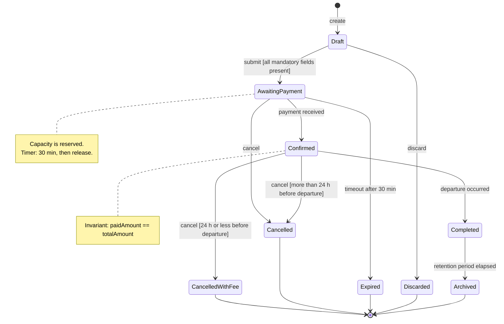
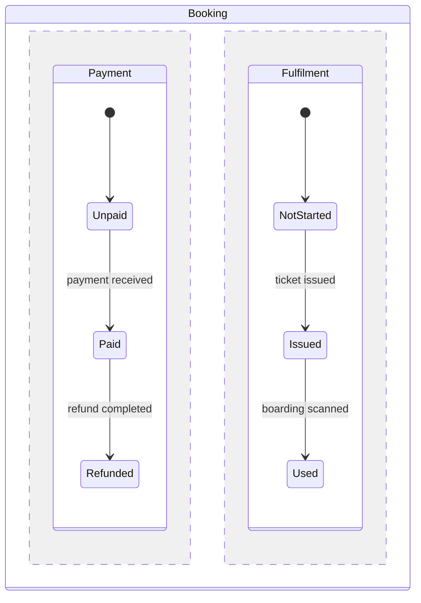

# State machines

Goal of this skill: pin down the **lifecycle of one entity** — every state it can be in, every event that moves it, the guards that permit the move, and every transition that must be impossible.

Use this skill for entities with a meaningful lifecycle (booking, claim, order, payment, flight, subscription, document approval), when "status" fields have grown organically, when bugs come from entities in impossible combinations, or when concurrency and retries create ambiguous states.

Do **not** use it to model a process across roles (`process-modeling`), the structure of data (`data-modeling`), or an actor's goal (`use-case-modeling`).

---

## 1. When a state machine is the right tool

| Signal | Verdict |
|--------|---------|
| A `status` column with more than four values | Model it |
| Business rules phrased as "you can only X when it is Y" | Model it |
| Bugs where an entity is in two statuses at once, or in none | Model it — you probably need parallel regions |
| Boolean flags multiplying (`isPaid`, `isCancelled`, `isArchived`) | Model it — `2^n` combinations hide illegal states |
| Compliance requires proof of who moved what, when | Model it, with an audit action on every transition |
| A field that only ever moves forward once | Do not over-model — a timestamp is enough |

Rule of thumb: **replace flag combinations with explicit states.** Three booleans allow eight combinations; usually only four are legal, and the other four are your production incidents.

---

## 2. Intake — ask before modeling

Ask only what is missing; batch into one message, five or fewer.

1. **Which entity**, and who owns its lifecycle? Which bounded context does it live in?
2. **What states exist today** — including the ones only the database knows about?
3. **What events move it**, and who or what triggers each one (user, system, timer, external party)?
4. **What must never happen** — which transitions are illegal, and what is the consequence if one occurs?
5. **What is time-dependent** — expiries, deadlines, automatic transitions, retention?

Ask specifically: *"Which states can it be in a year later?"* Terminal and archival states are the ones most often forgotten.

---

## 3. Elements

| Element | Definition | Rule |
|---------|------------|------|
| **State** | A condition in which the entity waits for events | Adjective or past participle: `Confirmed`, `Awaiting payment` — never a verb |
| **Initial state** | Where the entity begins | Exactly one; name the creating event |
| **Terminal state** | Where it stops moving | Name every one; "cancelled" and "completed" are different outcomes |
| **Event** | The trigger of a transition | Past tense or command: `payment received`, `cancel` |
| **Transition** | `source --event[guard]/action--> target` | Deterministic: one source + one event + true guard must select exactly one target |
| **Guard** | A boolean condition that permits the transition | Must be evaluable from data available at that moment |
| **Action / effect** | What happens on the transition | Side effects belong on transitions, not in states |
| **Entry / exit action** | Runs whenever a state is entered or left | Good place for notifications and audit records |
| **Invariant** | What must always be true while in a state | The bridge to `data-modeling` constraints |
| **Timeout** | A transition triggered by elapsed time | Every waiting state needs one, or a documented reason it does not |

**Hierarchical states** group related states under a superstate so shared transitions (like `cancel`) are written once. **Parallel regions** model genuinely independent dimensions — e.g. payment status and fulfilment status — instead of multiplying them into a combinatorial mess.

---

## 4. Method

1. **List the states** from the domain's own vocabulary — from `event-storming` events and the actual database values, not from an idealised design.
2. **Reconcile with reality.** Query production for the distinct status values and their counts. States that exist in data but not in the model are either historic bugs or undocumented behaviour; decide which.
3. **List the events**, with their trigger source: user, system, timer, external party.
4. **Fill the transition matrix** — every state × every event. Each cell is either a target state or "illegal". Empty cells are unanswered questions, not permission.
5. **Add guards and actions** to the transitions that need them.
6. **Write the invariant per state** — what must be true while it is there.
7. **Handle time**: expiry, escalation, retention, and archival. Add the timeout transitions.
8. **Handle concurrency**: what happens if the same event arrives twice, or two events arrive at once? Decide idempotency and optimistic-locking behaviour explicitly.
9. **Check reachability**: every state reachable from the initial state, every non-terminal state able to reach a terminal one. Unreachable states and dead ends are modeling defects.
10. **Generate tests** from the matrix — one per legal transition, one per illegal transition.

---

## 5. Output template

Write to `docs/discovery/state-machine-<entity>.md`.

````markdown
# State machine — <Booking>

- **Entity**: Booking · **Bounded context**: Ordering · **Owner**: Team A
- **Date**: <YYYY-MM-DD> · **Source**: event storming <link>, production status query <date>
- **Concurrency**: optimistic locking on `version`; all commands idempotent by `commandId`

## Diagram



### Parallel dimensions (if applicable)



## States

| State | Meaning | Invariant while in this state | Entry action | Exit action | Terminal? | Timeout |
|-------|---------|-------------------------------|--------------|-------------|-----------|---------|
| Draft | Being assembled by the customer | no capacity reserved | — | — | no | 7 d → Discarded |
| AwaitingPayment | Capacity reserved, money not received | `reservationId` set; `paidAmount = 0` | reserve capacity, start 30-min timer | cancel timer | no | 30 min → Expired |
| Confirmed | Paid and valid | `paidAmount = totalAmount`; ticket issued | issue ticket, notify customer | — | no | — |
| Cancelled | Cancelled without fee | refund initiated | release capacity, initiate refund | — | yes | — |

## Events

| Event | Trigger source | Payload | Idempotency key |
|-------|----------------|---------|-----------------|
| payment received | Payment context (event) | amount, reference | `paymentReference` |
| cancel | Customer or Agent (command) | reason, actor | `commandId` |
| timeout after 30 min | Timer | — | reservation id |

## Transition matrix

Legend: target state, `—` illegal (rejected with an error), `∅` ignored (idempotent no-op).

| State \ Event | submit | payment received | cancel | departure occurred | timeout |
|---|---|---|---|---|---|
| **Draft** | AwaitingPayment [fields complete] | — | Discarded | — | Discarded (7 d) |
| **AwaitingPayment** | — | Confirmed | Cancelled | — | Expired (30 min) |
| **Confirmed** | — | ∅ (duplicate) | Cancelled / CancelledWithFee [guard] | Completed | — |
| **Cancelled** | — | ∅ | ∅ | — | — |
| **Completed** | — | — | — | ∅ | Archived (retention) |

## Guards

| # | Transition | Guard | Data needed | Owner of the rule |
|---|-----------|-------|-------------|-------------------|
| G1 | Confirmed → Cancelled | departure is more than 24 h away | `departureAt`, `now` | fare rules §2 |
| G2 | Draft → AwaitingPayment | all mandatory passenger fields present | booking record | product |

## Illegal transitions and their handling

| Attempted | Response | Logged as | User-visible message |
|-----------|----------|-----------|----------------------|
| cancel on Completed | reject, HTTP 409 | `IllegalTransition` warn | "This booking has already been travelled." |
| payment received on Cancelled | accept and auto-refund | `LatePayment` alert to finance | — |

## Time and retention

| Rule | Trigger | Effect | Source |
|------|---------|--------|--------|
| Payment window | 30 min in AwaitingPayment | Expired, capacity released | product decision <date> |
| Retention | 24 months after Completed | Archived, personal data pseudonymised | GDPR policy §5 |

## Reality check against production data

| Status value in production | In model? | Count | Explanation | Action |
|----------------------------|-----------|-------|-------------|--------|
| `PENDING_MANUAL` | no | 412 | legacy manual review path | model it or migrate |

## Test cases derived

| # | From | Event | Guard | Expected | Type |
|---|------|-------|-------|----------|------|
| T1 | AwaitingPayment | payment received | — | Confirmed, ticket issued | legal |
| T2 | Completed | cancel | — | rejected 409, state unchanged | illegal |
| T3 | AwaitingPayment | payment received ×2 | — | Confirmed once, second ignored | idempotency |

## Open questions

| # | Question | Owner | Due |
|---|----------|-------|-----|
````

---

## 6. Anti-patterns

| Anti-pattern | Consequence | Do instead |
|--------------|-------------|------------|
| Boolean flags instead of states | `2^n` combinations, most of them illegal | One explicit state field |
| States named as verbs (`Cancelling`) | Ambiguity between the action and the resting condition | Past participle or adjective |
| Empty cells in the transition matrix | Undefined behaviour becomes "whatever the code does" | Every cell is a target, `—`, or `∅` |
| No timeouts on waiting states | Entities stuck forever; capacity leaked | Timeout plus escalation on every wait |
| Side effects inside states rather than transitions | Effects fire on re-entry or replay | Actions belong on transitions and entry/exit |
| Ignoring duplicate events | Double refunds, double bookings | Idempotency key per event, `∅` cells |
| One terminal state for everything (`Closed`) | Outcomes indistinguishable in reporting and support | Distinct terminal state per outcome |
| Model that contradicts the production data | The model is fiction | Query the real status values and reconcile |
| Unreachable states or dead ends left in | Dead code and confusing support cases | Check reachability both ways |
| No audit action on transitions in a regulated flow | No proof of who moved what | Audit as an entry action or a transition effect |

---

## 7. Checklist

- [ ] Entity, owning context, and lifecycle owner named
- [ ] States taken from the domain vocabulary and reconciled with production data
- [ ] Exactly one initial state; every terminal outcome distinct and named
- [ ] Every event listed with its trigger source and idempotency key
- [ ] Transition matrix complete — no empty cells
- [ ] Guards evaluable from data available at the moment of the transition
- [ ] Invariant documented per state
- [ ] Actions placed on transitions and entry/exit, not inside states
- [ ] Timeout and escalation for every waiting state, or a documented reason there is none
- [ ] Duplicate and out-of-order event behaviour decided
- [ ] Concurrency strategy stated (locking, idempotency)
- [ ] Reachability checked in both directions; no dead ends or orphan states
- [ ] Illegal transitions have a defined response and log level
- [ ] Retention and archival modelled
- [ ] Test cases generated for legal, illegal, and idempotent transitions
