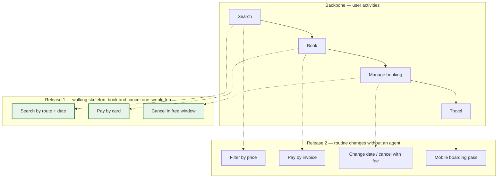

# Story mapping

Goal of this skill: replace a flat backlog with a **two-dimensional picture of the whole product** — the user's journey across the top, the stories that support each step underneath, sliced horizontally into releases that each deliver a usable outcome.

Use this skill when planning a release or an MVP, when a flat backlog has lost its shape, when stakeholders cannot see what they are getting, when onboarding people onto a product, or when scope must be cut and someone needs to see what is being lost.

Do **not** use it to specify a single story (`user-stories`, `example-mapping`) or to decide *why* something is worth building (`impact-mapping` first — a beautiful map of the wrong product is still the wrong product).

---

## 1. The two axes

| Axis | Content | Ordering principle |
|------|---------|--------------------|
| **Horizontal — narrative flow** | The user's activities and steps, left to right in the order they happen | Time / sequence, not priority |
| **Vertical — detail and necessity** | Stories that implement each step, most essential at the top | Necessity, not effort |

Three levels of granularity:

| Level | Name | Example | Count |
|-------|------|---------|-------|
| Top row | **Activities** (the backbone) | Search · Book · Manage booking · Travel | 4–10 |
| Second row | **Steps** (the walking skeleton) | Enter route and date · Choose fare · Pay · Confirm | 3–8 per activity |
| Below | **Stories / details** | Pay by card · Pay by invoice · Save card | as many as needed |

**Horizontal slices are releases.** Each slice must cut across the entire backbone — a release that completes one activity perfectly and leaves the next one missing is not usable.

---

## 2. Intake — ask before mapping

Ask only what is missing; batch into one message, five or fewer.

1. **Which user and which journey** — whose experience are we mapping, and from where to where?
2. **What outcome is this product for** — which goal or impact does it serve, and how is it measured?
3. **What already exists** — a live product, a prototype, nothing?
4. **What is the constraint** — a date, a budget, a demo, a regulatory deadline?
5. **Who is in the room** — is there someone who has actually spoken to users, and someone who can decide scope?

If more than one user type has a materially different journey, map the primary one first and add the others as extra backbone rows, clearly labelled. One map per persona if the journeys barely overlap.

---

## 3. Workshop script (half a day)

1. **Frame** (10 min). State the user, the journey boundaries, and the outcome the product serves.
2. **Write the story of use** (30–40 min). Everyone writes the steps a user takes, silently, one per card. Narrate a real end-to-end usage from start to finish.
3. **Arrange left to right** (20 min). Order by time. Duplicates stack. Argue about the order now, not later.
4. **Name the activities** (15 min). Group the steps and give each group a name. This is the backbone.
5. **Walk it aloud** (10 min). Tell the whole story from left to right. Gaps become obvious the moment someone has to narrate them.
6. **Add details underneath** (40 min). For each step: alternatives, variations, exceptions, "what if", and known pains. Volume matters here; do not filter.
7. **Add the other users** (15 min). Support agents, administrators, operations — separate rows, labelled.
8. **Find the walking skeleton** (20 min). The thinnest line of stories that lets one user get end to end, however crudely.
9. **Slice releases** (30 min). Draw horizontal lines. Each slice gets a name and an **outcome**, not a date.
10. **Test the slices** (15 min). For each: could a real user do something useful with only this? What do we learn from it? If neither answer is good, re-slice.
11. **Record risks and open questions** (10 min).

---

## 4. Slicing strategies

| Strategy | Slice by | When |
|----------|----------|------|
| **Walking skeleton first** | One crude path end to end | Always the first slice |
| **By outcome** | What the user can now achieve | Default |
| **By user segment** | One persona at a time | Distinct journeys |
| **By channel** | Web first, then mobile, then API | Multi-channel products |
| **By data variation** | Simple cases first, complex later | Domestic before international |
| **By quality level** | Manual now, automated later | Operations-heavy products |
| **By risk** | Riskiest assumption first | High uncertainty |

Rules: every slice is releasable; every slice teaches you something; sophistication is added *down* the map, never by adding another activity to the backbone.

---

## 5. Using the map after the workshop

| Use | How |
|-----|-----|
| **Scope negotiation** | Point at what falls below the line. Cutting becomes visible instead of abstract |
| **Progress** | Colour cards by state; the map shows coverage, not just a burn-down number |
| **Onboarding** | The backbone explains the product in five minutes |
| **Dependency visibility** | Vertical gaps show steps with no implementation |
| **Prioritisation input** | Feed the slices, not individual cards, into `prioritization` |
| **Release planning** | Slice names become release goals with success measures |

Keep it alive: date it, keep it in one place everyone can reach, review it at each release boundary, and record what moved and why. A story map that is not updated becomes wallpaper within two sprints.

---

## 6. Output template

Write to `docs/discovery/story-map-<product>.md`.

````markdown
# Story map — <product / journey>

- **Date**: <YYYY-MM-DD> · **User**: <primary persona> · **Facilitator**: <name>
- **Outcome this serves**: <goal + measure, link to impact map>
- **Journey**: from <trigger> to <end state> · **Board**: <link>

## Backbone and slices

| Activity → | Search | Book | Manage booking | Travel |
|---|---|---|---|---|
| **Steps** | enter route + date · see results · choose fare | enter passengers · pay · confirm | view booking · change · cancel | check in · board |
| **R1 — walking skeleton**<br/>*a customer can book and cancel one simple trip* | route + date search | pay by card | cancel in free window | — |
| **R2 — reduce support load**<br/>*routine changes done without an agent* | filter by price | pay by invoice | change date · cancel with fee | mobile boarding pass |
| **Later** | saved searches · fare alerts | instalments · vouchers | rebook · group changes | seat selection |

## Map



## Releases

| Slice | Outcome for the user | Success measure | Target | What we learn | Status |
|-------|----------------------|-----------------|--------|---------------|--------|
| R1 | Can book and cancel a simple trip | completed bookings / week | 50 in the pilot | whether the fare rules are understood | in progress |
| R2 | Routine changes need no agent | support contacts for changes | −60 % | which changes people actually make | planned |

## Stories

| ID | Activity | Step | Story | Slice | Size | Status |
|----|----------|------|-------|-------|------|--------|
| STORY-201 | Manage booking | cancel | Cancel in the free window | R1 | M | ready |

## Gaps and risks

| # | Gap / risk | Where in the map | Impact | Action | Owner |
|---|-----------|------------------|--------|--------|-------|
| G1 | No step covers "customer cannot pay" | Book / pay | blocks R1 | add story for payment failure | <name> |

## Changes since the last review

| Date | Change | Reason | Decided by |
|------|--------|--------|-----------|
````

---

## 7. Anti-patterns

| Anti-pattern | Consequence | Do instead |
|--------------|-------------|------------|
| Backbone ordered by priority | The narrative is destroyed; the map stops being a story | Left to right is time, top to bottom is necessity |
| Vertical slices (one activity fully, then the next) | Nothing usable until the end | Horizontal slices across the whole backbone |
| No walking skeleton | Integration risk discovered late | Thinnest end-to-end path first |
| Slices named by date | Scope silently expands to fill the date | Name slices by outcome |
| Map built without anyone who has met a user | A map of the team's assumptions | Include research findings; run `contextual-inquiry` if absent |
| Map built once and archived | Wallpaper within two sprints | Review at each release boundary; record changes |
| Every persona on one map | Unreadable | Primary journey first; other users as labelled rows or separate maps |
| Detail cards written as tasks ("build API") | The map becomes a work breakdown | Cards describe what the user can do |
| Mapping before knowing why | An excellent map of the wrong product | `impact-mapping` first |
| Backbone with 25 activities | Not a backbone — that is the detail level | 4–10 activities; push the rest down |

---

## 8. Checklist

- [ ] Primary user and journey boundaries stated
- [ ] Outcome and measure linked before mapping
- [ ] Backbone ordered by narrative time, 4–10 activities
- [ ] Steps under each activity form a usable end-to-end path
- [ ] Details ordered vertically by necessity, not by effort
- [ ] Map walked aloud end to end at least once
- [ ] Other user types added as labelled rows
- [ ] Walking skeleton identified and marked
- [ ] Releases sliced horizontally, each one releasable and named by outcome
- [ ] Each slice has a success measure and a learning goal
- [ ] Gaps (steps with no story) identified and assigned
- [ ] Cards describe user capabilities, not tasks
- [ ] Map dated, stored where everyone can reach it, with a review trigger
