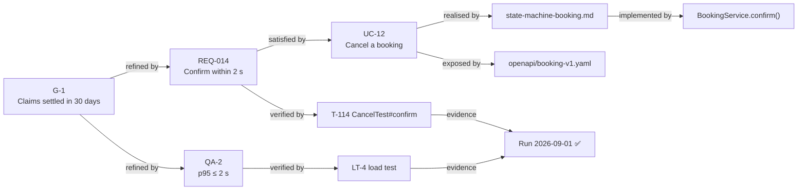

# Traceability matrix and traceability checks

Goal of this skill: be able to answer, at any moment, **why does this exist, and how do we know it works** — for every requirement — and **what breaks if this changes** — for every proposed change.

Use this skill in regulated and safety-critical work where it is mandatory, in contractual delivery where scope must be provable, on long-lived systems where nobody remembers why a rule exists, and before any large change where impact must be assessed rather than guessed.

Do **not** build a full matrix for a short-lived internal product. Trace the things whose "why" is expensive to lose: regulatory obligations, contractual commitments, safety rules, and anything nobody can re-derive.

---

## 1. The trace model

The chain, and what each link answers:

```text
Stakeholder need / goal
        ↓  why does this requirement exist?
Requirement (functional or quality)
        ↓  where is it realised?
Design artifact (use case, state machine, contract, architecture decision)
        ↓  where is it built?
Implementation (module, component, event)
        ↓  how do we know it works?
Verification (test, review, analysis, demonstration) → Evidence (run, report)
```

| Direction | Question | Detects |
|-----------|----------|---------|
| **Forward** (need → test) | Is everything we promised built and verified? | Gaps: unimplemented or untested requirements |
| **Backward** (test → need) | Why does this exist? | Orphans: gold-plating, dead requirements, obsolete tests |
| **Bidirectional** | Both | Required by most standards, including ISO/IEC/IEEE 29148 and safety regimes |

Useful additional link types: **depends-on** (requirement to requirement), **conflicts-with** (`risk-conflict-analysis`), **refines** (goal decomposition, `goal-modeling`), **satisfies** (design to requirement), **verifies** (test to requirement), and **supersedes** (change history).

---

## 2. Identifier discipline — the precondition for all of it

| Rule | Why |
|------|-----|
| Stable, unique, meaningless-but-typed ids (`REQ-014`, `QA-3`, `UC-12`, `STORY-201`) | Renaming or renumbering destroys history |
| Never reuse an id, even for a deleted item | An id in an old test report must still resolve |
| Mark deleted items as deleted, with the date and the reason | Deletion is a fact, not an absence |
| One id per requirement — never per paragraph | Paragraphs merge and split; requirements do not |
| Ids referenced in code comments, commit messages, test names, and ADRs | Makes automated tracing possible |
| Version the requirement, not just the document | Impact analysis needs to know which version a test verified |

Without identifier discipline, a traceability matrix is a snapshot that is wrong within a month.

---

## 3. Building and maintaining the matrix

1. **Decide the scope** — what must be traced, and to what depth. Trace regulatory and safety items fully; trace ordinary product work at the goal → story → test level.
2. **Establish the ids** and put them in every artifact.
3. **Populate the links** — as artifacts are created, not in a retrospective clean-up week.
4. **Automate what you can**: test-name-to-requirement tags, commit-message ids, contract-to-requirement annotations, and a report generated in CI. Manual matrices decay.
5. **Run the checks** (below) at every baseline and before every release.
6. **Use it for impact analysis** on every change request (`change-management`).

---

## 4. The traceability checks

| Check | Finds | Action |
|-------|-------|--------|
| **Orphan requirements** | Requirements with no source goal or stakeholder need | Justify or delete |
| **Unimplemented requirements** | Requirement with no design or code link | Schedule or descope |
| **Unverified requirements** | Requirement with no test or verification method | Add verification — mandatory in regulated work |
| **Orphan tests** | Tests verifying nothing traceable | Keep with a justification, or delete |
| **Gold-plating** | Code or features tracing to no requirement | Question the scope |
| **Broken links** | Ids pointing to deleted or renamed items | Repair; investigate how it happened |
| **Stale verification** | Test verifying an older version of the requirement | Re-verify |
| **Coverage by criticality** | Safety, regulatory, or high-priority items with weaker coverage than low-priority ones | Rebalance |
| **Conflict links unresolved** | Requirements marked conflicting with no resolution | Escalate (`risk-conflict-analysis`) |
| **Evidence missing** | Verification exists but no recorded passing run | Produce the evidence |

Report coverage as counts with named exceptions, never as a single percentage — "96 % traced" hides which 4 % is missing, and the missing 4 % is usually the interesting part.

---

## 5. Impact analysis

When something changes, the matrix answers "what else":

1. Identify the changed item and its version.
2. Traverse **forward**: design, code, tests, documentation, contracts, training material.
3. Traverse **backward**: which goal or obligation was it satisfying, and is that still satisfied?
4. Traverse **sideways**: `depends-on` and `conflicts-with` links.
5. Check external commitments: published API versions (`api-contracts`), SLAs, regulatory filings.
6. Produce the impact list with effort and risk, and feed it into the change decision.

---

## 6. Output templates

### 6.1 Trace model

````markdown
# Traceability — <system>

- **Scope of tracing**: regulatory and safety items fully; product items at goal → story → test
- **Id scheme**: `G-` goal · `REQ-` requirement · `QA-` quality scenario · `UC-` use case · `STORY-` story · `T-` test · `ADR-` decision
- **Generated**: <date> from `traces.yaml` + test metadata · **Owner**: <name>


````

### 6.2 Matrix

````markdown
## Traceability matrix

| Requirement | Source / goal | Design | Implementation | Verification | Evidence | Priority | Status |
|-------------|---------------|--------|----------------|--------------|----------|----------|--------|
| REQ-014 | G-1, interview I3 | UC-12 step 6, `state-machine-booking.md` | `BookingService.confirm()` | T-114, LT-4 | run 2026-09-01 ✅ | must | verified |
| REQ-015 | G-1, obstacle O3 | UC-12 ext. 7a | `RefundRetryWorker` | T-121 | run 2026-09-01 ✅ | must | verified |
| REQ-021 | — | — | — | — | — | should | **orphan — justify or delete** |
| QA-9 | EAA 2025, K2 | `prototyping` state inventory | booking flow | axe scan + manual walkthrough | scan 2026-08-28 ⚠️ 1 serious | must | **not met** |

## Regulatory traceability

| Clause | Obligation | Interpretation (by, date) | Requirement | Verification | Evidence | Status |
|--------|-----------|---------------------------|-------------|--------------|----------|--------|
| EU 261 Art. 7(1)(a) | €250 compensation, ≤1500 km, ≥3 h delay | legal <name>, <date> | REQ-032 | T-208 | run 2026-09-01 ✅ | covered |
| EU 261 Art. 5(3) | Extraordinary circumstances exemption | legal <name>, <date> | — | — | — | **gap** |
````

### 6.3 Coverage report

````markdown
## Coverage report — <date>, baseline <id>

| Check | Total | Passing | Exceptions |
|-------|-------|---------|------------|
| Requirements with a source goal | 84 | 83 | REQ-021 (orphan) |
| Requirements with an implementation link | 84 | 80 | REQ-055, REQ-061 (planned R3); REQ-070, REQ-071 (descoped) |
| Requirements with a verification method | 84 | 84 | — |
| Requirements with passing evidence | 84 | 79 | QA-9 (a11y, 1 serious); 4 pending R3 |
| Regulatory clauses covered | 12 | 11 | EU 261 Art. 5(3) — **blocks release** |
| Tests tracing to a requirement | 412 | 397 | 15 legacy tests, justification pending |
| Requirements marked conflicting and unresolved | 2 | 0 | C1, C2 resolved <date> |

**Release verdict**: blocked by the Art. 5(3) gap and QA-9.
````

### 6.4 Impact analysis

````markdown
## Impact analysis — CR-17 "Cancellation window changes from 24 h to 48 h"

| Direction | Affected item | Type | Change needed | Effort | Risk |
|-----------|---------------|------|---------------|--------|------|
| forward | REQ-014, REQ-018 | requirement | threshold update | S | low |
| forward | `state-machine-booking.md` G1 guard | design | guard value | S | low |
| forward | T-114, T-116, T-119 (boundary cases) | test | all boundary cases rewritten | M | **medium — boundaries are where defects hide** |
| forward | `openapi/booking-v1.yaml` description + examples | contract | non-breaking | S | low |
| forward | Help centre article HC-88, agent training | documentation | update | S | low |
| backward | G-1 "reduce support load" | goal | still satisfied? re-check the measure after release | — | low |
| sideways | REQ-022 (fare rules) `depends-on` | requirement | fare policy alignment needed | M | medium |
| external | Partner X integration guide | contract | notify, 30-day notice per agreement | S | **medium — contractual notice** |

**Recommendation**: approve with a 30-day partner notice; boundary tests rewritten and re-reviewed before release.
````

---

## 7. Anti-patterns

| Anti-pattern | Consequence | Do instead |
|--------------|-------------|------------|
| Building the matrix at the end for an audit | Fiction assembled under time pressure | Populate links as artifacts are created |
| Reusing requirement ids | History and old reports become unresolvable | Never reuse; mark deleted |
| Tracing paragraphs instead of requirements | Links break on every edit | One id per requirement |
| Reporting a single coverage percentage | Hides which items are uncovered | Counts plus named exceptions |
| Manual matrix in a spreadsheet nobody regenerates | Stale within weeks | Automate from ids in tests, commits, and contracts |
| Only forward tracing | Gold-plating and dead requirements never surface | Trace backward too |
| Requirements with no verification method | Non-conforming, unprovable | Verification method is mandatory per requirement |
| Ignoring orphan tests | Suite grows, nobody knows what may be deleted | Justify or delete |
| Change made without impact analysis | Contract breach or silent regression discovered later | Traverse the matrix on every change request |
| Tracing everything on a short-lived product | Bureaucracy with no payoff | Trace what is expensive to lose |
| Trace links maintained by one person | Bus factor of one; decay | Ownership plus automation in CI |

---

## 8. Checklist

- [ ] Tracing scope and depth decided and justified
- [ ] Id scheme defined; ids stable, unique, never reused
- [ ] Ids present in requirements, design artifacts, code references, test names, and commits
- [ ] Every requirement traces backward to a goal, need, or obligation
- [ ] Every requirement traces forward to design, implementation, and verification
- [ ] Every verification links to recorded evidence of a passing run
- [ ] Orphan requirements and orphan tests identified and dispositioned
- [ ] Coverage reported as counts with named exceptions, not a bare percentage
- [ ] Coverage checked by criticality, not only in aggregate
- [ ] Regulatory clauses traced to requirements and tests, with gaps flagged as release blockers
- [ ] Conflict links resolved or escalated
- [ ] Stale verifications (test verifying an old requirement version) detected
- [ ] Impact analysis run on every change request, including external commitments
- [ ] Matrix regenerated automatically and checked at every baseline
