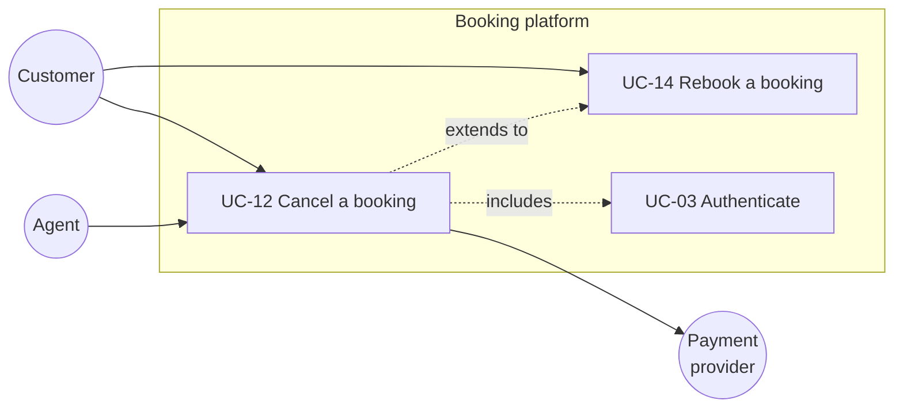
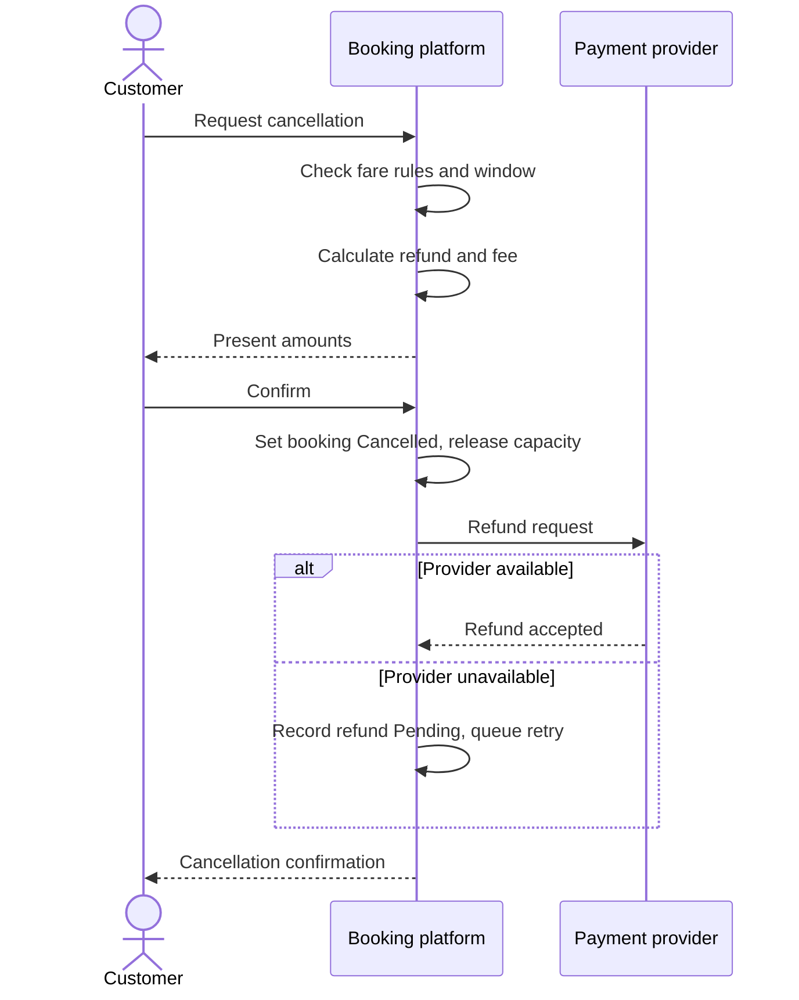

# Use case modeling

Goal of this skill: describe **how an actor achieves a goal through the system**, including everything that can go differently — in a form that is complete enough to design and test against, and readable by non-developers.

Use this skill when behaviour has many alternative and exception paths (IRREG flows, claims, approvals, regulated processes), when a story-sized description keeps losing the edge cases, when several actors interact through one transaction, or when acceptance testing needs a complete flow specification.

Do **not** use it for small increments of well-understood behaviour (`user-stories` + `example-mapping` is cheaper) or to model a business process across organisations (`process-modeling`).

---

## 1. The three goal levels

Mixing levels is the most common failure in use case work. Tag every use case explicitly.

| Level | Symbol | Question | Example | Typical length |
|-------|--------|----------|---------|----------------|
| **Summary** | ☁️ kite / cloud | What is the wider business flow this sits in? | *Fulfil a customer order* | Few steps, references user-goal cases |
| **User goal** | 🌊 sea level | What can one actor accomplish in one sitting? | *Cancel a booking* | **The useful level** — 3–9 main steps |
| **Subfunction** | 🐟 fish / clam | What sub-step is reused by several use cases? | *Authenticate user* | Only when genuinely reused |

Rule of thumb: **write at sea level.** Summary cases give context; subfunction cases only earn their place when reused by three or more use cases. Otherwise inline them.

---

## 2. Actors

| Actor type | Definition | Examples |
|------------|------------|----------|
| **Primary actor** | Has the goal; initiates the use case | Customer, Dispatcher, Claims Handler |
| **Supporting actor** | Provides a service to the system during the flow | Payment provider, Address validation API, SMS gateway |
| **Offstage / stakeholder** | Has an interest in the outcome but does not participate | Regulator, Finance, Data protection officer |

Every use case names **one** primary actor and **one** goal. If you need "or", you have two use cases. Offstage stakeholders drive the guarantees section — they are how compliance requirements get into the specification.

---

## 3. Intake — ask before writing

Ask only what is missing; batch into one message, five or fewer.

1. **Which goal**, for **which actor** — stated as a verb phrase from the actor's side?
2. **Where does it start and stop?** What triggers it and what counts as success?
3. **What is the system under design** — the whole product, one service, or an organisation including manual steps?
4. **What can go wrong** — which failures, refusals, timeouts, and rule violations are known already?
5. **What guarantees must hold even on failure** (money, legal record, audit trail, data protection)?

If the answer to (1) arrives as a screen or a feature ("the cancellation page"), ladder up to the goal ("cancel a booking and get the money back").

---

## 4. Structure of a use case

| Field | Content | Rule |
|-------|---------|------|
| **Name** | Active verb phrase: *Cancel a booking* | Never a noun ("Booking management") |
| **Scope** | The system under design | Name it — "the booking platform", not "the system" |
| **Level** | summary / user goal / subfunction | Always stated |
| **Primary actor** | Who has the goal | Exactly one |
| **Stakeholders and interests** | Who cares, and what they need out of it | Drives the guarantees |
| **Preconditions** | What the system guarantees is true before the flow starts | Checkable, not wishful |
| **Trigger** | The event that starts it | |
| **Minimal guarantee** | What holds even when the flow fails | The audit trail, the money, the consistency |
| **Success guarantee** | What holds when it succeeds | |
| **Main success scenario** | Numbered steps, 3–9 | See step rules below |
| **Extensions** | `3a`, `3b` … conditions and their handling | The real value of the format |
| **Special requirements** | Performance, security, legal constraints tied to this flow | Links to `quality-attributes` |
| **Open questions** | With owners | |

**Step rules:**

- One sentence per step, active voice, subject first: *"The system validates the cancellation window."*
- Only three kinds of step: an actor sends something to the system, the system validates or computes something, the system changes state or communicates with a supporting actor.
- No UI in the steps ("the user clicks the blue button") — write the intent, not the widget.
- No `if` inside a step. Conditions belong in extensions.
- 3–9 steps. Longer means the goal level is wrong.

**Extension notation:** the number of the step it branches from, plus a letter, then the condition, then the handling steps. Extensions can rejoin the main flow, end the use case, or fork further (`3a1a`).

---

## 5. Use case vs user story

| | Use case | User story |
|---|---------|------------|
| Unit | A complete goal, all paths | A slice of value, one conversation |
| Strength | Completeness, exception coverage, testability | Small, negotiable, fast to plan |
| Weakness | Heavier to write and maintain | Edge cases scatter or vanish |
| Best for | Regulated flows, complex exceptions, contracts, replacement projects | Incremental product work |

They compose well: **write the use case to understand the whole flow, then slice it into stories** — the main success scenario as the walking skeleton, each extension as its own story. Record the mapping so nothing is lost.

---

## 6. Output template

Write to `docs/discovery/use-case-<slug>.md`.

````markdown
# Use case — <UC-12: Cancel a booking>

| Field | Value |
|-------|-------|
| Scope | Booking platform |
| Level | user goal |
| Primary actor | Customer |
| Supporting actors | Payment provider, Email service |
| Trigger | Customer requests cancellation of an existing booking |
| Preconditions | Customer is authenticated; booking exists and is in state `Confirmed` |
| Minimal guarantee | Booking state and every attempted refund are recorded in the audit log |
| Success guarantee | Booking is `Cancelled`; refund is initiated per policy; customer is notified |

## Stakeholders and interests

| Stakeholder | Interest |
|-------------|----------|
| Customer | Cancel quickly and know exactly what is refunded |
| Finance | Refunds follow policy and are reconcilable |
| Data protection officer | Cancellation reason is optional and not shared with third parties |

## Main success scenario

1. Customer requests cancellation of a booking.
2. System verifies the booking is cancellable under the fare rules.
3. System calculates the refund amount and the cancellation fee.
4. System presents the amounts and asks for confirmation.
5. Customer confirms.
6. System sets the booking to `Cancelled` and releases the reserved capacity.
7. System instructs the payment provider to refund the calculated amount.
8. System notifies the customer with a cancellation confirmation.

## Extensions

| # | Condition | Handling |
|---|-----------|----------|
| 2a | Booking is outside the free-cancellation window | 2a1. System calculates the fee per fare rules. 2a2. Continue at step 3. |
| 2b | Booking is already `Cancelled` | 2b1. System informs the customer and ends the use case. |
| 2c | Departure is less than 2 h away | 2c1. System refuses cancellation, offers the rebooking flow (UC-14), ends the use case. |
| 5a | Customer does not confirm within 15 min | 5a1. System discards the quote; booking remains `Confirmed`. |
| 7a | Payment provider is unavailable | 7a1. System records the refund as `Pending`. 7a2. System queues a retry. 7a3. Continue at step 8 with a "refund pending" message. |
| 7b | Refund is rejected by the provider | 7b1. System creates a manual finance task. 7b2. System notifies the customer that the refund is being processed manually. |

## Special requirements

| # | Requirement | Type | Source |
|---|-------------|------|--------|
| SR1 | Refund calculation must complete within 2 s at p95 | performance | `quality-attributes` QA-3 |
| SR2 | Every state change is written to the immutable audit log | compliance | Finance policy §7 |

## Actor–goal map



## Main flow as a sequence



## Derived stories

| Story | Covers | Priority |
|-------|--------|----------|
| STORY-201 Cancel inside the free window | main flow, extension 2b | must |
| STORY-202 Cancellation fee outside the window | 2a | must |
| STORY-203 Refund retry when the provider is down | 7a, 7b | should |

## Open questions

| # | Question | Owner | Due |
|---|----------|-------|-----|
| Q1 | Who may cancel on the customer's behalf, and with what evidence? | <name> | <date> |
````

---

## 7. Anti-patterns

| Anti-pattern | Consequence | Do instead |
|--------------|-------------|------------|
| UI steps in the scenario ("clicks Save") | The specification dies at the next redesign | Write intent, not widgets |
| `if` inside a step | Branch logic hidden in prose | Move it to an extension |
| Twenty-step main scenario | Wrong goal level, unreadable | Split; write at sea level |
| CRUD use cases ("Manage users") | No goal, no testable flow | One use case per real goal |
| Subfunction cases for everything | Fragmentation; nobody can read the flow | Extract only when reused 3+ times |
| No minimal guarantee | Failure behaviour is undefined where it matters most | State what holds even on failure |
| Extensions only for the happy-adjacent cases | The nasty paths surface in production | Walk every step and ask "what else can happen here?" |
| Use cases maintained after the code diverges | Documentation that actively misleads | Date them; tie them to tests or retire them |
| Use case *and* duplicate stories with the same detail | Two sources of truth | Use case for the whole flow, stories reference it |

---

## 8. Checklist

- [ ] One primary actor and one goal per use case, named as a verb phrase
- [ ] Goal level tagged and consistent (sea level for the working set)
- [ ] Scope names the system under design explicitly
- [ ] Stakeholders and their interests listed, including offstage ones
- [ ] Preconditions are checkable, not aspirational
- [ ] Minimal and success guarantees both stated
- [ ] Main success scenario is 3–9 numbered, UI-free, condition-free steps
- [ ] Every step examined for extensions; failure of every supporting actor covered
- [ ] Extensions numbered against the step they branch from
- [ ] Special requirements linked to quality attribute scenarios
- [ ] Actor–goal map and sequence diagram included
- [ ] Derived stories mapped so no extension is lost
- [ ] Open questions carry owners and dates
