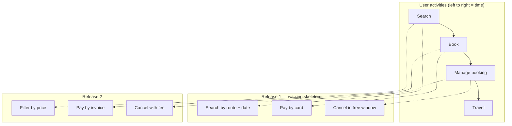

# User stories and acceptance criteria

Goal of this skill: keep requirements small, conversation-oriented, and verifiable — a **placeholder for a conversation** plus the criteria that decide when it is done.

Use this skill for incremental product work, when turning a use case, impact map, or example map into backlog items, and when a backlog has become a list of unverifiable wishes.

Do **not** use it to specify a complete flow with many exception paths (`use-case-modeling`), to model a domain (`event-storming`), or to justify scope (`impact-mapping`).

---

## 1. The three C's

A story is not a document. It is three things, in order:

| C | Meaning | Failure if skipped |
|---|---------|--------------------|
| **Card** | A short written promise of value — deliberately incomplete | Nothing to point at in planning |
| **Conversation** | The discussion where the detail is actually created (`example-mapping`) | Assumptions diverge; rework in review |
| **Confirmation** | The acceptance criteria that settle "done" | Endless "is this finished?" debates |

A perfectly written card with no conversation is worse than a rough card with a good one.

---

## 2. Formats

| Format | Template | Use for |
|--------|----------|---------|
| **Role–goal–benefit** | As a `<role>`, I want `<goal>`, so that `<benefit>` | Default; forces the "why" |
| **Job story** | When `<situation>`, I want to `<motivation>`, so I can `<outcome>` | When the situation matters more than the persona (`jobs-to-be-done`) |
| **Enabler / technical** | In order to `<capability>`, we need `<technical work>` so that `<user-visible consequence>` | Infrastructure work that must still trace to value |
| **Bug** | Given `<context>`, `<observed>` instead of `<expected>` | Defects; keep the expected behaviour explicit |
| **Spike** | Timeboxed investigation of `<question>`; done when `<decision made>` | Unknowns — always with a timebox and a decision criterion |

Rules for the benefit clause: it must state a real consequence. *"…so that I can use the feature"* means nobody knows why. If you cannot write the benefit, run `impact-mapping` before writing more stories.

---

## 3. INVEST

| Letter | Test | Fails when | Fix |
|--------|------|-----------|-----|
| **I**ndependent | Can it be built in any order? | "Only after STORY-12" | Reorder scope, or merge the two |
| **N**egotiable | Is the *how* still open? | The card prescribes the implementation | Move solution detail to the conversation |
| **V**aluable | Does a user or the business notice? | "Add an index to table X" | Bundle into the story whose value it enables, or state the user-visible consequence |
| **E**stimable | Can the team size it? | "Nobody knows" | Split off a spike |
| **S**mall | Fits comfortably in one iteration? | Multi-sprint | Split (see below) |
| **T**estable | Is there an objective pass/fail? | "The system should be fast" | Write a measurable criterion (`quality-attributes`) |

Run INVEST as a checklist in refinement, not as a purity contest — "independent" in particular is an aspiration, not a law.

---

## 4. Splitting patterns

Use these when a story is too big. Always split **vertically** — every slice must go end to end and be releasable, even if narrow.

| Pattern | Split by | Example |
|---------|----------|---------|
| **Workflow steps** (SPIDR: *Steps*) | Stages of the flow | Checkout: address → payment → confirmation |
| **Business rule variations** (SPIDR: *Rules*) | One rule per story | Standard refund first; partial refunds later |
| **Data variations** (SPIDR: *Data*) | Data types or ranges | Domestic addresses first, international later |
| **Interface** (SPIDR: *Interface*) | Channel or fidelity | API before UI; plain list before filters |
| **Spike** (SPIDR: *Spike*) | Extract the unknown | Timeboxed investigation, then re-estimate |
| **Paths** | Happy path vs errors | Successful upload first, failure handling next |
| **CRUD split** | Operations | Create + read now, update + delete later |
| **Effort/quality (hamburger)** | Layers of each step, at minimum quality first | Manual trigger now, scheduled later |
| **Defer performance** | Correct first, fast later | Works at 100 rows; 100k rows is its own story |

**Horizontal splits are the failure mode**: "the backend story" and "the frontend story" deliver nothing alone and hide integration risk until the end.

---

## 5. Acceptance criteria

Choose the style that fits the story; do not force Gherkin onto everything.

| Style | Shape | Best for |
|-------|-------|----------|
| **Scenario (Gherkin)** | Given / When / Then | Behaviour with clear context and outcome; automatable |
| **Rule-based** | A bullet list of conditions that must hold | Validation rules, calculations, permissions |
| **Checklist** | Verifiable statements | UI states, content, configuration |
| **Constraint** | Measurable threshold | Performance, accessibility, security (`quality-attributes`) |

Quality bar for every criterion:

- **Objective** — two people testing it reach the same verdict.
- **Written before implementation starts** — criteria invented at review are negotiation, not verification.
- **Complete on the boundaries** — below, exactly at, above every threshold.
- **Free of implementation** — say what, not how.
- **Includes the negative cases** — what must *not* happen, what must be rejected.
- **Includes non-functional constraints that apply to this story** — not deferred to a mythical later phase.

```gherkin
Feature: Cancel a booking

  Rule: Cancellations more than 24 h before departure are free

    Example: 25 hours before departure
      Given a confirmed booking departing in 25 hours
      When the customer cancels it
      Then the full amount is refunded
      And the booking state is "Cancelled"

    Example: exactly 24 hours before departure
      Given a confirmed booking departing in exactly 24 hours
      When the customer cancels it
      Then the full amount is refunded

    Example: 23 hours before departure
      Given a confirmed booking departing in 23 hours
      When the customer cancels it
      Then a cancellation fee of 20 % is deducted
```

---

## 6. Definition of Ready and Done

Agree both as a team; keep them short enough that people actually apply them.

**Ready** (before pulling into an iteration): value stated · acceptance criteria written · dependencies known · sized · open questions answered or explicitly deferred · designs available where needed · test data available.

**Done** (before calling it complete): criteria demonstrably met · tests written and passing · reviewed · non-functional constraints checked · documentation updated · deployed to the agreed environment · no known defects deliberately hidden.

---

## 7. Output templates

### 7.1 Story

````markdown
# STORY-201 — Cancel a booking inside the free window

**As a** customer
**I want** to cancel a booking that departs in more than 24 hours
**So that** I get my money back without calling support.

- **Epic**: EPIC-12 Booking self-service · **Derived from**: UC-12 (main flow), example map `EM-201`
- **Impact**: I2 "Customers resolve changes without contacting support" (`impact-map-support-load.md`)
- **Size**: M · **Priority**: must

## Acceptance criteria

1. **Given** a confirmed booking departing in more than 24 h, **when** the customer cancels it, **then** the full amount is refunded and the state becomes `Cancelled`.
2. **Given** a booking departing in exactly 24 h, **when** the customer cancels it, **then** the full amount is refunded.
3. **Given** a booking already in state `Cancelled`, **when** the customer opens the cancellation flow, **then** the action is unavailable with an explanatory message.
4. The reserved capacity is released within 5 s of the cancellation (p95).
5. Every state change is written to the audit log with actor, timestamp, and reason.
6. The flow is operable by keyboard only and passes an axe scan with no serious violations.

## Out of scope

- Cancellations inside 24 h (STORY-202)
- Refund failure handling (STORY-203)

## Open questions

| # | Question | Owner | Due | Blocking? |
|---|----------|-------|-----|-----------|

## Notes from the conversation

- <decisions, examples, rejected options>
````

### 7.2 Epic and slice plan

````markdown
# EPIC-12 — Booking self-service

- **Goal it serves**: <link to impact map> · **Owner**: <name>
- **Success measure**: support contacts for cancellations 480/month → below 150 by <date>

## Stories

| ID | Story | Slice type | Size | Priority | Status |
|----|-------|-----------|------|----------|--------|
| STORY-201 | Cancel inside free window | workflow step | M | must | ready |
| STORY-202 | Cancellation fee outside window | business rule | S | must | draft |

## Walking skeleton

<the thinnest end-to-end slice that proves the flow>

## Not doing (and why)

| Idea | Reason | Revisit when |
|------|--------|--------------|
````

### 7.3 Story map

````markdown
# Story map — <product / journey>



| Activity | Release 1 | Release 2 | Later |
|----------|-----------|-----------|-------|
| Search | search by route + date | filter by price | saved searches |
| Book | pay by card | pay by invoice | pay by instalments |
| Manage booking | cancel in free window | cancel with fee | rebook |
````

---

## 8. Anti-patterns

| Anti-pattern | Consequence | Do instead |
|--------------|-------------|------------|
| Story as a mini-specification | The conversation never happens | Card + conversation + confirmation |
| "So that I can use the feature" | The value is unknown, so priority is arbitrary | Trace to an impact or delete the story |
| Horizontal splits (backend / frontend) | Nothing is releasable; integration risk piles up at the end | Vertical slices, always |
| Acceptance criteria written at review | Verification becomes negotiation | Criteria before implementation |
| "The system should be fast/user-friendly" | Untestable | Measurable threshold (`quality-attributes`) |
| Criteria that prescribe the implementation | Removes the team's design space | Say what, not how |
| No negative or boundary cases | Off-by-one and validation defects ship | Below / at / above, plus rejections |
| Epics never sliced until sprint planning | Planning becomes analysis under time pressure | Refine ahead, keep two iterations of ready stories |
| Story with unresolved blocking questions pulled into a sprint | Half-done work at the sprint end | Definition of Ready gate |
| Technical stories with no user-visible consequence | Backlog fills with work nobody can prioritise | Attach the enabler to the story it unblocks |

---

## 9. Checklist

- [ ] Story states role, goal, and a real benefit
- [ ] Traceable to a goal, impact, or use case
- [ ] INVEST checked; oversized stories split vertically
- [ ] Splitting pattern named, not improvised
- [ ] Acceptance criteria objective, written before implementation
- [ ] Boundary values and negative cases covered
- [ ] Non-functional constraints relevant to this story stated and measurable
- [ ] Out-of-scope list written so reviewers do not expect more
- [ ] Open questions listed with owners; blocking ones prevent "Ready"
- [ ] Definition of Ready and Definition of Done applied
- [ ] Conversation notes captured on the story, not lost in chat
